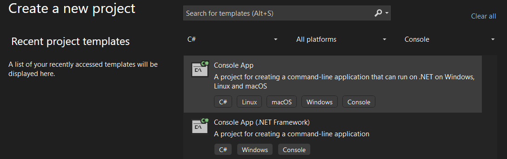

# Get Familiar with Syntax Trees

In this chapter, you’ll get hands-on experience with **syntax trees** by inspecting them visually using the **Syntax Visualizer** and **DGML graphs**.

Syntax trees are the backbone of Roslyn’s capabilities;
understanding them now will help make sense of more complex topics like semantic models and project loading later in the workshop.

Syntax trees are made up of **nodes** (language constructs), **tokens** (smallest syntax elements), and **trivia** (whitespace, comments, etc.)
that collectively represent the structure of your code.

> [!NOTE]
> This part is specific to Visual Studio 2022, as other IDEs do not include the **Syntax Visualizer** or **DGML** graph options.
> If you are unable to use Visual Studio 2022, you can still follow along and use the images provided to understand the behavior and visualize the output.

## Prerequisites

To complete this chapter, ensure that you have **Visual Studio 2022** installed with the **[.NET Compiler Platform SDK][ROSLYN_SDK]** and **DGML editor**.

## Step 1: Open *Visual Studio 2022*

## Step 2: Create a new *Console App*

1. In Visual Studio, select *Create a new project*.
2. Choose **Console App**.

   

3. Click **Next**.

## Step 3: Configure the new *Console App* project

1. Name the project `ConsoleApp1`.
2. Store the project in a straightforward location on disk.
3. You can place the solution in the same folder as the project for simplicity.

   > [!NOTE]
   > Avoid placing your code too deeply in a folder structure, as we will reference the absolute path in later exercises.

   

4. Click **Next**.
5. For the additional information, leave the default settings as they are.

   

6. Click **Create**.

## Step 4: Open the *Syntax Visualizer* window

You can find this tool in Visual Studio 2022 by navigating to `View > Other Windows > Syntax Visualizer`.

   

## Step 5: Explore the *Syntax Tree*

With Syntax Visualizer open, navigate through your code to examine the **syntax tree**.
Explore the **nodes**, **tokens**, and **trivia** components in the tree to understand the structure of your code.

   

Check the properties panel for additional details, including **spans**, which indicate the range within the source code that a particular element covers.

   

## Step 6: View a *DGML Graph* of your code selection

1. Highlight the line `Console.WriteLine("Hello World!");`.
2. In the Syntax Visualizer, right-click the `ExpressionStatement` for the line you selected.
3. Select *View Directed Syntax Graph* from the context menu.

   

   A Directed Graph Markup Language (DGML) graph will be opened that visualizes the relationships between nodes, tokens, and trivia,
   providing a clear overview of the internal representation of your code by Roslyn.

   > [!TIP]
   > If Visual Studio crashes, simply reopen it and retry these steps.
   > It might help to remove the `.vs` folder in the solution directory.

   

   > [!NOTE]
   > Your DGML graph may look slightly different, but make sure you can identify the main components, such as nodes for `ExpressionStatement` and `Console.WriteLine()`.

## Complete solution

You can compare your project with the sample solution: [ConsoleApp1 solution](solutions/01/ConsoleApp1).

## Next Steps

For a deeper dive into Roslyn, and to learn how to use analyzers to generate documentation and refactor code,
continue to the next chapter or explore more about the **[.NET Compiler Platform SDK][ROSLYN_SDK]**.

[ROSLYN_SDK]: https://learn.microsoft.com/dotnet/csharp/roslyn-sdk/?wt.mc_id=AZ-MVP-5004268
