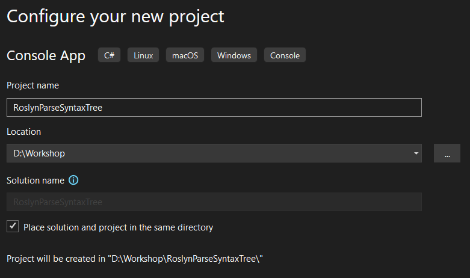

# Parse Source Code

*Now that we have visualized syntax trees, let's take it a step further by parsing code and inspecting its structure.*

In this chapter, you will learn how to parse source code into a syntax tree using Roslyn, Microsoft's compiler-as-a-service for .NET.
You'll also learn how to query the syntax tree using both object models and LINQ queries.

Understanding the structure of syntax trees and how to interact with them is key to creating custom analyzers, refactoring tools, or automated documentation solutions.

> [!NOTE]
> This guide uses Visual Studio 2022 and the .NET Compiler Platform SDK. Be sure to have these installed before continuing.

## Step 1: Open *Visual Studio 2022*

## Step 2: Create a new *Console App*

1. In Visual Studio, select *Create a new project*.
2. Choose **Console App**.

   

3. Click **Next**.

## Step 3: Configure the new *Console App* project

1. Name the project `RoslynParseSyntaxTree`.
2. Store the project in a straightforward location on disk.
3. You can place the solution in the same folder as the project for simplicity.

   

4. Click **Next**.
5. For the additional information, leave the default settings as they are.

   

6. Click **Create**.

## Step 4: Add a NuGet reference to Microsoft.CodeAnalysis.CSharp

Add a reference to the Microsoft.CodeAnalysis.CSharp NuGet package to gain access to Roslyn's APIs for parsing and analyzing C# code.

* Console

  ```powershell
  dotnet add package "Microsoft.CodeAnalysis.CSharp"
  ```

* Package Manager

  

## Step 5: Add namespaces

Add the following namespaces to the `Program.cs` file to access the Roslyn APIs:

```csharp
using Microsoft.CodeAnalysis;
using Microsoft.CodeAnalysis.CSharp;
using Microsoft.CodeAnalysis.CSharp.Syntax;
using Microsoft.CodeAnalysis.Text;
```

## Step 6: Parse source code from text

Using [`CSharpSyntaxTree.ParseText`][SDK_PARSETEXT], you can parse text into a syntax tree.
We will use a simple application to demonstrate parsing. This application includes a familiar `Console.WriteLine` statement that prints 'Hello World!'.

```csharp
SyntaxTree tree = CSharpSyntaxTree.ParseText(
    """
    using System;

    namespace ConsoleApp1
    {
        class Program
        {
            static void Main(string[] args)
            {
                Console.WriteLine("Hello World!");
            }
        }
    }
    """);
```

## Step 7: Get the root of the Syntax Tree

To interact with the syntax tree, cast the root of the tree to a [`CompilationUnitSyntax`][SDK_COMPILATIONUNITSYNTAX].

```csharp
CompilationUnitSyntax root = (CompilationUnitSyntax)tree.GetRoot();
```

## Step 8: Interact with the root in the debugger

For this step we need to set a breakpoint. However, we can't set a breakpoint as there is no code after the last line of the program.
Therefore, we can add a `Console.ReadLine()` statement temporarily.

Set a breakpoint on the added line and run the application with the debugger (`[F5]`).

Inspect the `Usings` and `Members` properties of the root using the debugger.


Notice that you can keep navigating through the node members until you reach the method declaration.

## Step 9: Navigate the Tree with code

Just like you did with the debugger, you can navigate the syntax tree programmatically using LINQ.
This allows you to find and interact with specific elements in the tree.

### Assignment

1. Navigate to the first `using` statement.
2. Navigate to the first `namespace`.
3. Navigate to the first `class` within the namespace.
4. Navigate to the first `method` in the class.
5. Navigate to the first `statement` in the method body.

#### Optional

*You can drill down further into the `statement` and look at the `InvocationExpression` and the `MemberAccessExpression`.*

### Solution

If you need help, use the following code:

<details>
<summary>Reveal the solution</summary>

```csharp
UsingDirectiveSyntax @using = root.Usings.First();
NamespaceDeclarationSyntax @namespace = root.Members.OfType<NamespaceDeclarationSyntax>().First();
ClassDeclarationSyntax @class = @namespace.Members.OfType<ClassDeclarationSyntax>().First();
MethodDeclarationSyntax method = @class.Members.OfType<MethodDeclarationSyntax>().First();
ExpressionStatementSyntax expressionStatement = method.Body!.Statements.OfType<ExpressionStatementSyntax>().First();
```

</details>

## Step 10: Use *spans* to extract related source code

You can use the [`SyntaxTree.GetText` method][SDK_GETTEXT] to get a reference to the complete source text.
With [`SourceText.GetSubText`][SDK_GETSUBTEXT], you can extract a specific portion of the source using its `Span`.

```csharp
SourceText sourceText = tree.GetText();
```

### Assigment

Output the following source text to the `Console`:

1. The first `using` statement.
2. The first `statement` in the method body.

### Solution

<details>
<summary>Reveal the solution</summary>

```csharp
Console.WriteLine(sourceText.GetSubText(@using.Span));
Console.WriteLine(sourceText.GetSubText(expressionStatement.Span));
```

</details>

#### Expected Output

The output should read:

```plaintext
using System;
Console.WriteLine("Hello World!");
```

### Optional

*You can also drill down into the **InvocationExpression** and **MemberAccessExpression** to output individual parts.*

#### Expected Output

The output should read:

```plaintext
Console
WriteLine
```

### Awesomesauce

Try to output the first `argument` from the **InvocationExpression**.

#### Expected Output

The output should read:

```plaintext
"Hello World!"
```

## Complete solution

You can compare your project with the [RoslynParseSyntaxTree solution](solutions/02/RoslynParseSyntaxTree).

[SDK_PARSETEXT]: https://learn.microsoft.com/dotnet/api/microsoft.codeanalysis.csharp.csharpsyntaxtree.parsetext?wt.mc_id=AZ-MVP-5004268
[SDK_COMPILATIONUNITSYNTAX]: https://learn.microsoft.com/dotnet/api/microsoft.codeanalysis.csharp.syntax.compilationunitsyntax?wt.mc_id=AZ-MVP-5004268
[SDK_GETTEXT]: https://learn.microsoft.com/dotnet/api/microsoft.codeanalysis.syntaxtree.gettext?wt.mc_id=AZ-MVP-5004268
[SDK_GETSUBTEXT]: https://learn.microsoft.com/en-us/dotnet/api/microsoft.codeanalysis.text.sourcetext.getsubtext?wt.mc_id=AZ-MVP-5004268
