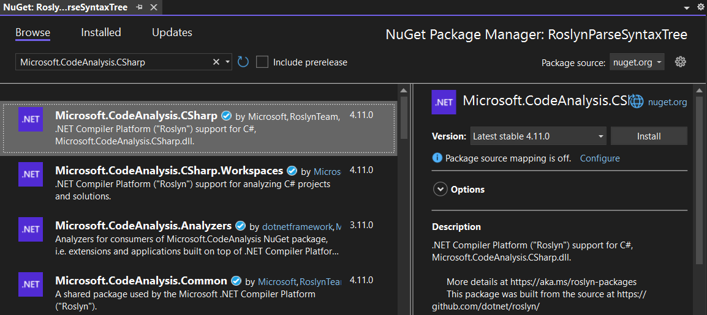

# Compile Source Code

In this chapter, you will learn how to compile source code to obtain semantic information from the compiler using Roslyn.

Understanding compilation and semantic analysis is crucial to building custom analyzers, refactoring tools, or more advanced code generation features.

> [!NOTE]
> This guide uses Visual Studio 2022 and the .NET Compiler Platform SDK. Be sure to have these installed before continuing.

## Step 1: Open *Visual Studio 2022*

## Step 2: Create a new *Console App*

1. In Visual Studio, select *Create a new project*.
2. Choose **Console App**.

    

3. Click **Next**.

## Step 3: Configure the new *Console App* project

1. Name the project `RoslynCompileSourceCode`.
2. Store the project in a straightforward location on disk.
3. You can place the solution in the same folder as the project for simplicity.

   

4. Click **Next**.
5. For additional information, leave the default settings as they are.

    

6. Click **Create**.

## Step 4: Add a NuGet reference to *Microsoft.CodeAnalysis.CSharp*

Add a reference to the Microsoft.CodeAnalysis.CSharp NuGet package to gain access to Roslyn's APIs for compiling and analyzing C# code.

* Console

  ```bash
  dotnet add package "Microsoft.CodeAnalysis.CSharp"
  ```

* Package Manager

  

## Step 5: Add namespaces

Remove the default code and add the following namespaces to the `Program.cs` file to access the Roslyn APIs:

```csharp
using System.Collections.Immutable;
using Microsoft.CodeAnalysis;
using Microsoft.CodeAnalysis.CSharp;
using Microsoft.CodeAnalysis.CSharp.Syntax;
```

## Step 6: Parse source code from text

Using [`CSharpSyntaxTree.ParseText`][SDK_PARSETEXT], you can parse text into a syntax tree.
We will use a simple application to demonstrate parsing. This application includes a familiar `Console.WriteLine` statement that prints 'Hello World!'.

```csharp
SyntaxTree tree = CSharpSyntaxTree.ParseText(
    """
    using System;

    namespace ConsoleApp1
    {
        class Program
        {
            static void Main(string[] args)
            {
                Console.WriteLine("Hello World!");
            }
        }
    }
    """);
```

## Step 7: Compile the source code

A `CSharpCompilation` is an object that takes one or more syntax trees and compiles them into an assembly.
This is similar to how Visual Studio compiles your project code into an executable or a library.

To compile the source code, create a [`CSharpCompilation`][SDK_CSHARPCOMPILATION] object with a name for the assembly. This name doesn't really matter.
You also need to add at least one syntax tree, which is the source code parsed in the previous steps.

```csharp
CSharpCompilation compilation = CSharpCompilation
    .Create("Workshop")
    .AddSyntaxTrees(tree);
```

To get information about the compilation, retrieve the diagnostics.

Diagnostics provide information about potential issues, such as syntax errors, in the parsed code.
This is similar to the **Error List** in Visual Studio and is helpful for understanding if the code is ready for successful compilation.
You can output these messages to the console.

In this case, we are only interested in non-hidden messages.

```csharp
ImmutableArray<Diagnostic> diagnostics = compilation.GetDiagnostics();

foreach (Diagnostic error in diagnostics.Where(d => d.Severity > DiagnosticSeverity.Hidden))
{
    Console.WriteLine(error);
}
```

Run the application. The compilation should throw a list of errors.

```plaintext
(1,7): error CS0246: The type or namespace name 'System' could not be found (are you missing a using directive or an assembly reference?)
(5,11): error CS0518: Predefined type 'System.Object' is not defined or imported
(7,26): error CS0518: Predefined type 'System.String' is not defined or imported
(7,16): error CS0518: Predefined type 'System.Void' is not defined or imported
(9,13): error CS0518: Predefined type 'System.Object' is not defined or imported
(9,13): error CS0103: The name 'Console' does not exist in the current context
(9,31): error CS0518: Predefined type 'System.String' is not defined or imported
(5,11): error CS1729: 'object' does not contain a constructor that takes 0 arguments
```

The compiler does not know where to get the details about the types used in the code should come from,
so you have to add the locations of the assemblies to the compiler manually.

A [`MetadataReference`][SDK_METADATAREFERENCE] tells the compiler about external types that the code relies on, such as `System` or `Console`.
This is similar to adding a reference to a library in Visual Studio to ensure that the compiler knows about all dependencies during the build process.

We can use the location of the assembly that contains the definition of `object` as a reference.
Change the `compilation` by adding a `MetadataReference` using this file's location.
You also need to make sure that the runtime assembly is referenced. This is the `System.Runtime.dll` file in the same directory as the previous file.

```csharp
string objectLocation = typeof(object).Assembly.Location;
string runtimeLocation = Path.Combine(Path.GetDirectoryName(objectLocation)!, "System.Runtime.dll");

CSharpCompilation compilation = CSharpCompilation
    .Create("Workshop")
    .AddReferences(MetadataReference.CreateFromFile(runtimeLocation))
    .AddReferences(MetadataReference.CreateFromFile(objectLocation))
    .AddSyntaxTrees(tree);
```

Run the application again. Only a single error will show up.

```plaintext
(9,13): error CS0103: The name 'Console' does not exist in the current context
```

### Assignment

Add the correct reference for `Console` and solve the error.

### Solution

If you need help, use the following code:

<details>
<summary>Reveal the solution</summary>

```csharp
string consoleLocation = typeof(Console).Assembly.Location;

    .AddReferences(MetadataReference.CreateFromFile(consoleLocation))
```

</details>

## Step 8: Get the root of the Syntax Tree

To interact with the syntax tree, cast the root of the tree to a [`CompilationUnitSyntax`][SDK_COMPILATIONUNITSYNTAX].

```csharp
CompilationUnitSyntax root = (CompilationUnitSyntax)tree.GetRoot();
```

## Step 9: Get the semantic model

Semantic analysis is an important step after parsing the syntax tree.
It involves assigning meaning to the syntactic elements of your code.
For example, it helps determine what method `WriteLine` refers to, whether `Console` is properly referenced, and so on.
This is key for creating documentation, as it goes beyond syntax and considers the actual meaning of the code.

Now that the compiler has analyzed the code, it can provide the **semantic** meaning of the word *WriteLine*.

*Accessing the semantic model is a resource-intensive operation and might be noticeable depending on the size of your application.*

Get the **InvocationExpression** connected to `WriteLine`. A quick way for now is using a LINQ statement.

```csharp
InvocationExpressionSyntax? invocationExpression = root
    .Members.OfType<NamespaceDeclarationSyntax>().First()
    .Members.OfType<ClassDeclarationSyntax>().First()
    .Members.OfType<MethodDeclarationSyntax>().First()
    .Body?.Statements.OfType<ExpressionStatementSyntax>().First()
    .Expression as InvocationExpressionSyntax;
```

You want to get the semantic model built during compilation and connect it to the source tree.

```csharp
SemanticModel semanticModel = compilation.GetSemanticModel(tree);
```

Ask the semantic model which Symbol is related to the **InvocationExpression**.

```csharp
ISymbol methodSymbol = semanticModel.GetSymbolInfo(invocationExpression!).Symbol!;
```

[`Console.WriteLine`][SDK_WRITELINE] has eighteen overloads.
If you look at the symbol information, it will only have the specific version of the method that the compiler has resolved for this invocation.

### Assignment

Output the following information from the Symbol:

1. The method `symbol`.
2. The `type` containing the method.
3. The `assembly` containing this type.

#### Awesomesauce

*A symbol holds much more information that can be used for purposes like syntax highlighting.
Output the list of the "Display Parts" of this symbol. Display parts are the different parts that you reconize as the namespace, class, method, punctuation,
and so on, of a line of source text. Focus on the **kind** and **name** of each part.*

### Solution

If you need help, use the following code:

<details>
<summary>Reveal the solution</summary>

```csharp
Console.WriteLine(methodSymbol);
Console.WriteLine(methodSymbol.ContainingType);
Console.WriteLine(methodSymbol.ContainingAssembly);
```

</details>

### Expected output

The final output should read:

```plaintext
System.Console.WriteLine(string?)
System.Console
System.Console, Version=8.0.0.0, Culture=neutral, PublicKeyToken=b03f5f7f11d50a3a
```

> [!NOTE]
> The output might vary slightly depending on the version of the .NET SDK you are using.

The Awesomesauce solution should give:

```plaintext
NamespaceName = System
Punctuation   = .
ClassName     = Console
Punctuation   = .
MethodName    = WriteLine
Punctuation   = (
Keyword       = string
Punctuation   = ?
Punctuation   = )
```

## Complete solution

You can compare your project with the [RoslynCompileSourceCode solution](solutions/03/RoslynCompileSourceCode).

[SDK_PARSETEXT]: https://learn.microsoft.com/dotnet/api/microsoft.codeanalysis.csharp.csharpsyntaxtree.parsetext?wt.mc_id=AZ-MVP-5004268
[SDK_COMPILATIONUNITSYNTAX]: https://learn.microsoft.com/dotnet/api/microsoft.codeanalysis.csharp.syntax.compilationunitsyntax?wt.mc_id=AZ-MVP-5004268
[SDK_METADATAREFERENCE]: https://learn.microsoft.com/dotnet/api/microsoft.codeanalysis.metadatareference?wt.mc_id=AZ-MVP-5004268
[SDK_WRITELINE]: https://learn.microsoft.com/dotnet/api/system.console.writeline?view=net-8.0&wt.mc_id=AZ-MVP-5004268
[SDK_CSHARPCOMPILATION]: https://learn.microsoft.com/dotnet/api/microsoft.codeanalysis.csharp.csharpcompilation?wt.mc_id=AZ-MVP-5004268
