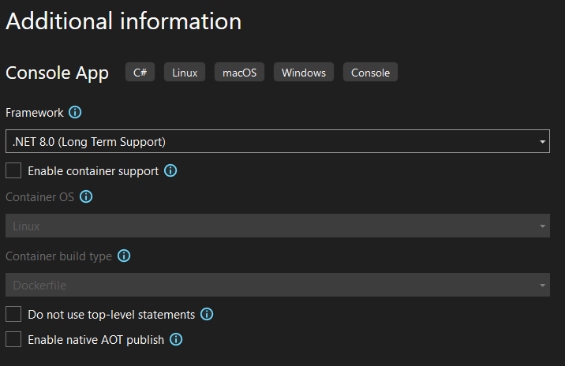

# Walk a Syntax Tree

*Traversing syntax trees enables powerful analysis of code structures, allowing us to collect data or build analyzers.
This builds on the syntax parsing from the previous chapter.*

In this chapter, you will learn how to walk through a syntax tree using the visitor pattern,
a powerful technique for traversing the nodes of a syntax tree to collect information or analyze the code structure.

Understanding how to traverse syntax trees is crucial to extracting meaningful data from code, building custom analyzers, or generating useful documentation.

> [!NOTE]
> This guide uses Visual Studio 2022 and the .NET Compiler Platform SDK. Be sure to have these installed before continuing.

## Step 1: Open *Visual Studio 2022*

## Step 2: Create a new *Console App*

1. In Visual Studio, select *Create a new project*.
2. Choose **Console App**.

    

3. Click **Next**.

## Step 3: Configure the new *Console App* project

1. Name the project `RoslynWalkSyntaxTree`.
2. Store the project in a straightforward location on disk.
3. You can place the solution in the same folder as the project for simplicity.

   

4. Click **Next**.
5. For additional information, leave the default settings as they are.

    

6. Click **Create**.

## Step 4: Add a NuGet reference to *Microsoft.CodeAnalysis.CSharp*

Add a reference to the `Microsoft.CodeAnalysis.CSharp` NuGet package to gain access to Roslyn's APIs for compiling and analyzing C# code.

* Console

  ```bash
  dotnet add package "Microsoft.CodeAnalysis.CSharp"
  ```

* Package Manager

  

## Step 5: Add namespaces

Remove the default code and add the following namespaces to the `Program.cs` file to access the Roslyn APIs:

```csharp
using Microsoft.CodeAnalysis;
using Microsoft.CodeAnalysis.CSharp;
using Microsoft.CodeAnalysis.CSharp.Syntax;
```

## Step 6: Parse source code from text

We will use a pre-prepared piece of source code with nested namespaces and `using` statements at multiple levels.
Using [`CSharpSyntaxTree.ParseText`][SDK_PARSETEXT], you can parse text into a syntax tree.

```csharp
SyntaxTree tree = CSharpSyntaxTree.ParseText(
    """
    using System;
    using System.Collections.Generic;
    using System.Linq;
    using System.Text;
    using Microsoft.CodeAnalysis;
    using Microsoft.CodeAnalysis.CSharp;

    namespace TopLevel
    {
        using Microsoft;
        using System.ComponentModel;

        namespace Child1
        {
            using Microsoft.Win32;
            using System.Runtime.InteropServices;

            class Foo { }
        }

        namespace Child2
        {
            using System.CodeDom;
            using Microsoft.CSharp;

            class Bar { }
        }
    }
    """);
```

This code contains nested namespaces and `using` statements at different levels,
meaning that you can't simply use the root node's `Usings` property or a single LINQ statement to retrieve all the `using` directives.

The goal of this exercise is to collect all `using` directives that are not part of the `System` namespace.
This reflects the dynamic nature of code where occurrences can be anywhere in the tree and can not be predicted upfront. Syntax Walkers are perfect for this scenario.

## Step 7: Get the root of the Syntax Tree

To interact with the syntax tree, cast the root of the tree to a [`CompilationUnitSyntax`][SDK_COMPILATIONUNITSYNTAX].

```csharp
CompilationUnitSyntax root = (CompilationUnitSyntax)tree.GetRoot();
```

### Step 8: Creating a *Syntax Walker*

There are two types of syntax visitors you can use to walk through a syntax tree: [`CSharpSyntaxWalker`][SDK_CSHARPSYNTAXWALKER] and [`CSharpSyntaxRewriter`][SDK_CSHARPSYNTAXREWRITER].

* **Syntax Walkers**: Used to visit nodes in a tree without modifying it.
* **Syntax Rewriters**: Used when you need to make modifications to the syntax tree, like in custom code analyzers or refactoring tools.

For documentation purposes, we only want to read the syntax tree, so the **Syntax Walker** is more appropriate.

Create a new file called `UsingCollector.cs`.

Add the following namespaces to the `UsingCollector.cs` file.

```csharp
using Microsoft.CodeAnalysis.CSharp;
using Microsoft.CodeAnalysis.CSharp.Syntax;
```

Make a class called `UsingCollector` that inherits from `CSharpSyntaxWalker`.

```csharp
class UsingCollector : CSharpSyntaxWalker
{
}
```

The base class has over 240 virtual methods that you can override for specific functionality. This is the power of the visitor pattern.

In this example, you are only interested in declarations of `using` statements. To do this, override the [`VisitUsingDirective`][SDK_VISITUSINGDIRECTIVE] method.

```csharp
public override void VisitUsingDirective(UsingDirectiveSyntax node)
{
}
```

Whenever the visitor encounters a [`UsingDirectiveSyntax`][SDK_USINGDIRECTIVESYNTAX] node anywhere in the tree, this method will be invoked.

### Assignment

1. Check if each `using` directive is not part of `System`.
2. Store the list of discovered `using` directives in a property called `Usings` on the `UsingCollector` class.

### Solution

If you need help, use the following code:

<details>
<summary>Reveal the solution</summary>

```csharp
class UsingCollector : CSharpSyntaxWalker
{
    public readonly List<UsingDirectiveSyntax> Usings = [];

    public override void VisitUsingDirective(UsingDirectiveSyntax node)
    {
        if (node.Name!.ToString() != "System" &&
            !node.Name.ToString().StartsWith("System.", StringComparison.Ordinal))
        {
            Usings.Add(node);
        }
    }
}
```

</details>

## Step 9: Use the Walker on the Syntax Tree

With the **Syntax Walker** in place, go back to `Program.cs`, create an instance of the walker, and execute the `Visit` method using the root as an argument.

```csharp
UsingCollector collector = new();
collector.Visit(root);
```

### Assignment

1. List all `using` directives that are not part of `System`.

### Solution

If you need help, use the following code:

<details>
<summary>Reveal the solution</summary>

```csharp
foreach (UsingDirectiveSyntax usingDirective in collector.Usings)
{
    Console.WriteLine(usingDirective.Name);
}
```

</details>

#### Expected Output

When running the code, the final output should read:

```plaintext
Microsoft.CodeAnalysis
Microsoft.CodeAnalysis.CSharp
Microsoft
Microsoft.Win32
Microsoft.CSharp
```

## Complete solution

You can compare your project with the [RoslynWalkSyntaxTree solution](solutions/04/RoslynWalkSyntaxTree).

[SDK_PARSETEXT]: https://learn.microsoft.com/dotnet/api/microsoft.codeanalysis.csharp.csharpsyntaxtree.parsetext?wt.mc_id=AZ-MVP-5004268
[SDK_COMPILATIONUNITSYNTAX]: https://learn.microsoft.com/dotnet/api/microsoft.codeanalysis.csharp.syntax.compilationunitsyntax?wt.mc_id=AZ-MVP-5004268
[SDK_CSHARPSYNTAXWALKER]: https://learn.microsoft.com/dotnet/api/microsoft.codeanalysis.csharp.csharpsyntaxwalker?wt.mc_id=AZ-MVP-5004268
[SDK_CSHARPSYNTAXREWRITER]: https://learn.microsoft.com/dotnet/api/microsoft.codeanalysis.csharp.csharpsyntaxrewriter?wt.mc_id=AZ-MVP-5004268
[SDK_VISITUSINGDIRECTIVE]: https://learn.microsoft.com/dotnet/api/microsoft.codeanalysis.csharp.csharpsyntaxvisitor.visitusingdirective?wt.mc_id=AZ-MVP-5004268
[SDK_USINGDIRECTIVESYNTAX]: https://learn.microsoft.com/dotnet/api/microsoft.codeanalysis.csharp.syntax.usingdirectivesyntax?wt.mc_id=AZ-MVP-5004268
