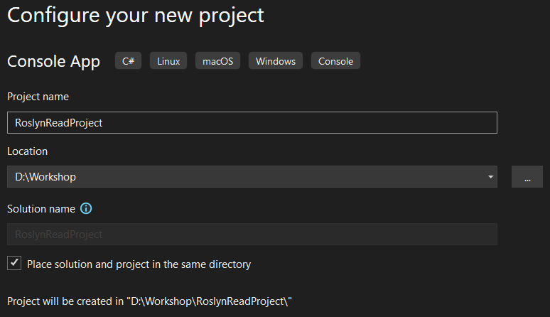
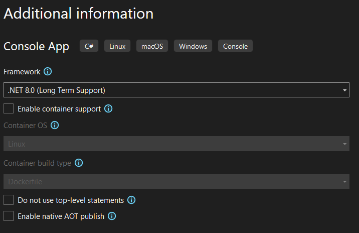
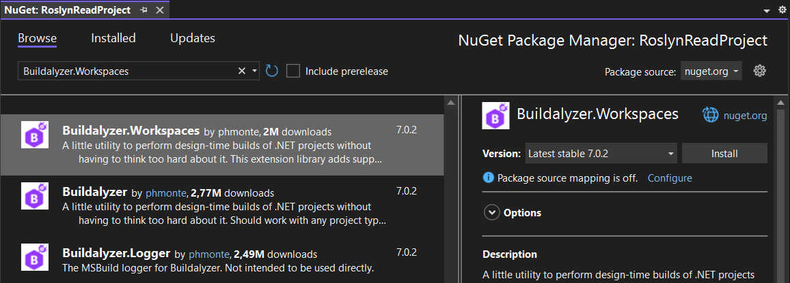

# Load a Project or Solution

*In previous chapters, we manually built syntax trees and compilations. Now, let’s leverage Buildalyzer to automatically load entire projects.*

Until now, you had to do a lot of manual steps to parse a single tree, get the right references in the compiler, and get the semantic model.

This approach will not scale well if you want to work with a complete project or Visual Studio solution.

In this chapter, you are going to parse a complete project using [Buildalyzer](https://github.com/phmonte/Buildalyzer).

> [!NOTE]
> This guide uses **Visual Studio 2022** and the **[.NET Compiler Platform SDK][ROSLYN_SDK]**. Be sure to have these installed before continuing.

## Step 1: Open *Visual Studio 2022*

## Step 2: Create a new *Console App*

1. In Visual Studio, select *Create a new project*.
2. Choose **Console App** targeting .NET.

    

3. Click **Next**.

## Step 3: Configure the new *Console App* project

1. Name the project `RoslynReadProject`.
2. Store the project in a straightforward location on disk.
3. You can place the solution in the same folder as the project for simplicity.

   

4. Click **Next**.
5. For additional information, leave the default settings as they are.

   

6. Click **Create**.

## Step 4: Add a NuGet reference to *Buildalyzer.Workspaces*

Add a reference to the [`Buildalyzer.Workspaces`][NUGET_BUILDALYZER] NuGet package to gain access to Buildalyzer's capabilities for analyzing .NET projects.

* Console

  ```bash
  dotnet add package "Buildalyzer.Workspaces"
  ```

* Package Manager

  

## Step 5: Add namespaces

Remove the default code and add the following namespaces to the Program.cs file to access the Roslyn and Buildalyzer APIs:

```csharp
using System.Collections.Immutable;
using Buildalyzer;
using Buildalyzer.Workspaces;
using Microsoft.CodeAnalysis;
using Microsoft.CodeAnalysis.CSharp.Syntax;
using Microsoft.CodeAnalysis.Text;
```

## Step 6: Read a project

To start using Buildalyzer, create an `AnalyzerManager` instance.
Use the `AnalyzerManager.GetProject` method to read the `ConsoleApp1` project you created in the first chapter.

```csharp
AnalyzerManager analyzerManager = new();
IProjectAnalyzer projectAnalyzer = analyzerManager.GetProject(@"D:\workshop\ConsoleApp1\ConsoleApp1.csproj");
```

To parse the structure and references of the project, use the `AnalyzerManager.Build` method.
The result is a collection of analyzer results, but in this case, you only need the first result.

```csharp
IAnalyzerResult analyzerResults = projectAnalyzer.Build().First();
```

### Assignment

Remember that in chapter 3, you added a single syntax tree and three references.

Output the following figures:

1. The number of `references`.
2. The number of `source files`.

   *Are you surprised by this output?* — Notice the additional generated files, such as global usings and assembly attributes, which you might not have expected.
   These files are often automatically created by the SDK to support your project.

3. Write the list of source files.

### Solution

If you are not able to come up with the code yourself, you can use the following code:

<details>
<summary>Reveal the solution</summary>

```csharp
Console.WriteLine($"{analyzerResults.References.Length} references");
Console.WriteLine($"{analyzerResults.SourceFiles.Length} source files");

Console.WriteLine();
foreach (string file in analyzerResults.SourceFiles)
{
    Console.WriteLine(file);
}
```

</details>

### Expected Output

When running the code, the final output should read:

```plaintext
163 references
4 source files

D:\workshop\ConsoleApp1\Program.cs
D:\workshop\ConsoleApp1\obj\Debug\net8.0\ConsoleApp1.GlobalUsings.g.cs
D:\workshop\ConsoleApp1\obj\Debug\net8.0\.NETCoreApp,Version=v8.0.AssemblyAttributes.cs
D:\workshop\ConsoleApp1\obj\Debug\net8.0\ConsoleApp1.AssemblyInfo.cs
```

## Step 7: Create a *Workspace*

Although you have read the project data into the manager, you cannot work on the syntax trees directly yet. First, create a workspace.
A workspace allows you to work with the entire solution and provides a unified view of projects, documents, and other components, similar to an IDE.
This helps make semantic analysis and code navigation tasks simpler and consistent.

```csharp
AdhocWorkspace workspace = projectAnalyzer.GetWorkspace();
```

The **workspace** has references to all loaded **solutions**, **projects**, **documents**, and more.
Just like Visual Studio, loading a project automatically creates a solution.

Get a reference to the single project that is part of the solution and call the `Project.GetCompilationAsync` method.  
You will notice this method takes time, as it runs the same process that is executed when you compile a project in **Visual Studio** or with **MSBuild**.

Like the compilation we did manually before, you could look at the diagnostics to see if anything went wrong.

```csharp
Project project = workspace.CurrentSolution.Projects.First();
Compilation compilation = project.GetCompilationAsync().Result!;

ImmutableArray<Diagnostic> diagnostics = compilation.GetDiagnostics();

foreach (Diagnostic error in diagnostics.Where(l => l.Severity > DiagnosticSeverity.Hidden))
{
    Console.WriteLine(error);
}
```

## Step 8: Work with the *Syntax Trees*

Previously, we worked with a single syntax tree that was created manually.
In a full project, every file is represented by a syntax tree. With multiple files, you can now iterate through the `Compilation.SyntaxTrees` property.

### Assignment

Use your skills from earlier assignments. For each syntax tree, get the source text and output:

1. The **filename** of the source file.
2. The **source text** of that file.

If you worked with .NET Framework projects before, you would recognize one of the files that you might have thought did not exist anymore in .NET projects.

### Solution

If you need help, use the following code:

<details>
<summary>Reveal the solution</summary>

```csharp
foreach (SyntaxTree syntaxTree in compilation.SyntaxTrees)
{
    CompilationUnitSyntax root = (CompilationUnitSyntax)syntaxTree.GetRoot();
    SourceText text = root.GetText();

    Console.WriteLine();
    Console.WriteLine(Path.GetFileName(syntaxTree.FilePath));
    Console.WriteLine(text.GetSubText(root.Span));
}
```

</details>

### Expected Output

When running the code, the final output should read:

```plaintext
Program.cs
Console.WriteLine("Hello, World!");


ConsoleApp1.GlobalUsings.g.cs
global using global::System;
global using global::System.Collections.Generic;
global using global::System.IO;
global using global::System.Linq;
global using global::System.Net.Http;
global using global::System.Threading;
global using global::System.Threading.Tasks;


.NETCoreApp,Version=v8.0.AssemblyAttributes.cs
using System;
using System.Reflection;
[assembly: global::System.Runtime.Versioning.TargetFrameworkAttribute(".NETCoreApp,Version=v8.0", FrameworkDisplayName = ".NET 8.0")]


ConsoleApp1.AssemblyInfo.cs
using System;
using System.Reflection;

[assembly: System.Reflection.AssemblyCompanyAttribute("ConsoleApp1")]
[assembly: System.Reflection.AssemblyConfigurationAttribute("Debug")]
[assembly: System.Reflection.AssemblyFileVersionAttribute("1.0.0.0")]
[assembly: System.Reflection.AssemblyInformationalVersionAttribute("1.0.0")]
[assembly: System.Reflection.AssemblyProductAttribute("ConsoleApp1")]
[assembly: System.Reflection.AssemblyTitleAttribute("ConsoleApp1")]
[assembly: System.Reflection.AssemblyVersionAttribute("1.0.0.0")]

// Generated by the MSBuild WriteCodeFragment class.
```

## Step 9: And the *Semantic Model*?

Remember that you create a semantic model by passing a `SyntaxTree` as an argument.
Therefore, if you want to use the semantic model for multiple files, you must create one for each syntax tree inside the loop.

```csharp
    SemanticModel semanticModel = compilation.GetSemanticModel(syntaxTree);
```

## Complete solution

You can compare your project with the [RoslynReadProject solution](solutions/05/RoslynReadProject).

[ROSLYN_SDK]: https://learn.microsoft.com/dotnet/csharp/roslyn-sdk/?wt.mc_id=AZ-MVP-5004268
[NUGET_BUILDALYZER]: https://www.nuget.org/packages/Buildalyzer.Workspaces
