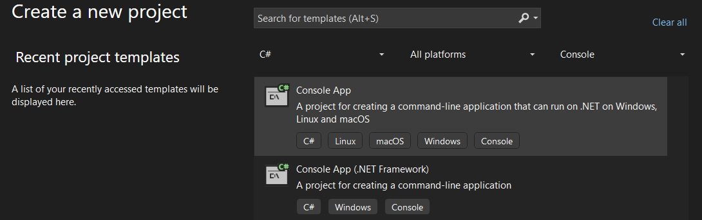
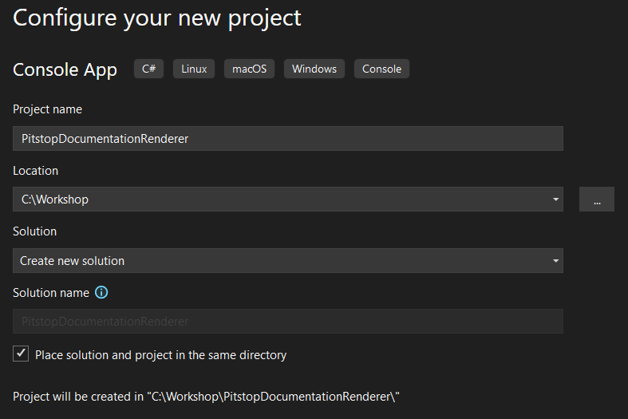
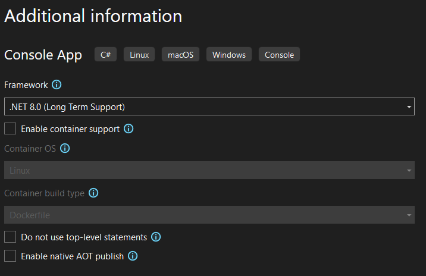

# Working with _TypeDescriptions_

In this chapter, you will use the JSON file generated in the previous step to inspect the types of the **Pitstop** sample project.
You'll build a small console application that reads the intermediate file and prints information about several types in their role in the application.

## Prerequisites

You will need the **.NET SDK** and the `pitstop.analyzed.json` file generated in [chapter 1](01-generate-intermediate-file.md).

## Step 1: Create a new *Console App*

<details open>

<summary>Console</summary>

1. Open a terminal window.
2. Navigate to the directory where you want to create the project.

   ```shell
   mkdir "PitstopDocumentationRenderer"
   cd "PitstopDocumentationRenderer"
   ```

3. Run the following command to create a new console application:

   ```shell
   dotnet new console --name "PitstopDocumentationRenderer" --framework "net8.0"
   ```

4. Create a solution file and add the project to it:

   ```shell
   dotnet new sln --name "PitstopDocumentationRenderer"
   dotnet sln add "PitstopDocumentationRenderer"
   ```

</details>

<details>

<summary>Visual Studio</summary>

1. Open *Visual Studio*
2. Select *Create a new project*.
3. Choose **Console App**.

   

4. Click **Next**.
5. Name the project `PitstopDocumentationRenderer`.
6. Save the project in a convenient location on your disk.
7. You can place the solution in the same folder as the project for simplicity.

   

8. Click **Next**.
9. For the additional information, leave the default settings as they are.

   

10. Click **Create**.

</details>

## Step 2: Add the _NuGet Reference_

You will need to add the following NuGet package to your project:

- `DendroDocs.Client`

<details open>
<summary>Console</summary>

1. Open a terminal window.
2. Navigate to the project directory:

   ```shell
   cd "PitstopDocumentationRenderer"
   ```

3. Run the following command to add the `DendroDocs.Client` package:

   ```shell
   dotnet add package "DendroDocs.Client"
   ```

</details>

<details>
<summary>Visual Studio</summary>

1. Right-click on the project in the Solution Explorer.
2. Select *Manage NuGet Packages*.
3. Go to the *Browse* tab.
4. Search for `DendroDocs.Client`.
5. Select the package and click *Install*.


</details>

## Step 3: Add the _namespaces_

Open the `Program.cs` file and add the following namespaces at the top:

```csharp
using System.Text.Json;
using DendroDocs;
using DendroDocs.Extensions;
using DendroDocs.Json;
```

## Step 4: Read the _intermediate JSON file_

1. To store all type information in memory, add a list of `TypeDescription` to your program.

   ```csharp
   List<TypeDescription> types;
   ```

2. Read the JSON file contents.

   Deserialize the file contents with `JsonSerializer.Deserialize`.
   Use the `JsonDefaults.DeserializerOptions` method to get the deserializer options to correctly restore the contents into memory.

   ```csharp
   // Path to the JSON file containing the analyzed types
   var fileContents = File.ReadAllText("pitstop.analyzed.json");

   types = JsonSerializer.Deserialize<List<TypeDescription>>(fileContents, JsonDefaults.DeserializerOptions())!;
   ```

## Step 5: Get _Type Information_

To get information about a specific type, you can use the `First` extension method. Use the full type name as the argument.

For example, to get the [`DayHasPassed` class](https://github.com/dendrodocs/workshops-dotnet-sample-pitstop/blob/main/src/TimeService/Events/DayHasPassed.cs).

```csharp
var type = types.First("Pitstop.TimeService.Events.DayHasPassed");
```

Use the debugger to see which properties are available.

### 🧑‍🏫 Assignment

Output the following information for the `DayHasPassed` class.

1. A list of all **base classes**.
2. A list of all **fields**.

#### Solution

If you need help, use the following code:

<details>
<summary>Reveal the solution</summary>

```csharp
Console.WriteLine("Base types:");
foreach (var baseType in type.BaseTypes)
{
  Console.WriteLine($"- {baseType}");
}

Console.WriteLine();
Console.WriteLine("Fields:");
foreach (var field in type.Fields)
{
  Console.WriteLine($"- {field.Name}");
}

Console.WriteLine();
```

</details>

#### Expected Output

The output should read:

```plaintext
Base types:
- Pitstop.Infrastructure.Messaging.Event

Fields:
```

## Step 6: Fix _inheritance_

If you look at the source code, `DayHasPassed` inherits from [`Event`](https://github.com/dendrodocs/workshops-dotnet-sample-pitstop/blob/main/src/Infrastructure.Messaging/Event.cs), which inherits from `Message`.
The [`Message` class](https://github.com/dendrodocs/workshops-dotnet-sample-pitstop/blob/main/src/Infrastructure.Messaging/Message.cs) has two fields: `MessageId` and `MessageType`.

```csharp
public class Message
{
  public readonly Guid MessageId;
  public readonly string MessageType;

  ...
}
```

However, they are not present in the output of the previous step.

To correctly reflect inheritance, you need to populate the base types and their members.

1. Add the following code to the `Program.cs` file, after reading the JSON file:

   ```csharp
   types.PopulateInheritedBaseTypes();
   types.PopulateInheritedMembers();
   ```
2. Run the code again.

   The output should read:

   ```plaintext
   Base types:
   - Pitstop.Infrastructure.Messaging.Event
   - Pitstop.Infrastructure.Messaging.Message

   Fields:
   - MessageId
   - MessageType
   ```

## Interlude: _What are Commands and Events?_

> [!IMPORTANT]
> **Commands vs Events: The Basics**
>
> We encountered classes like `Event` and `Message`. Until now the meaning of events, commands, and messages was not important.
> If you are not familiar with event-driven architecture, here is a brief overview of the most important concepts that will come up in the next steps. 
>
> **Command**  
> An instruction to perform an action (e.g., “RegisterCustomer”).
> Is handled by only one component (the handler).
> Represents an intention—something should happen.
>
> **Event**  
> A notification that something has happened (e.g., “CustomerRegistered”).
> Can be listened to by multiple components (many event handlers).
> Represents a fact or change in the system.
> 
> **Example:**  
> When you send a `RegisterCustomer` command, it is processed by a specific handler.
> If successful, the system then emits a `CustomerRegistered` event.
> Any interested part of the system can then react to this event.

## Step 7: Get a list of _commands_

In Pitstop, **Commands** are classes that inherit from the [`Pitstop.Infrastructure.Messaging.Command` class](https://github.com/dendrodocs/workshops-dotnet-sample-pitstop/blob/main/src/Infrastructure.Messaging/Command.cs).

To get a list of all types that inherit from this base class, you can use the `ImplementsType` method of the [`TypeDescription` class](https://github.com/dendrodocs/dotnet-shared-lib/blob/main/src/DendroDocs.Shared/Descriptions/TypeDescription.cs).

1. Add the following code to the end of the `Program.cs` file:

   ```csharp
   Console.WriteLine("Commands:");
   var commands = types.Where(t => t.ImplementsType("Pitstop.Infrastructure.Messaging.Command"));
   foreach (var command in commands)
   {
      Console.WriteLine($"- {command.FullName}");
   }
   ```
2. Run the code again.

   The output should read:

   ```plaintext
   Commands:
   - Pitstop.CustomerManagementAPI.Commands.RegisterCustomer
   - Pitstop.VehicleManagement.Commands.RegisterVehicle
   - Pitstop.WebApp.Commands.FinishMaintenanceJob
   - Pitstop.WebApp.Commands.PlanMaintenanceJob
   - Pitstop.WebApp.Commands.RegisterCustomer
   - Pitstop.WebApp.Commands.RegisterPlanning
   - Pitstop.WebApp.Commands.RegisterVehicle
   - Pitstop.WorkshopManagementAPI.Commands.FinishMaintenanceJob
   - Pitstop.WorkshopManagementAPI.Commands.PlanMaintenanceJob
   - WorkshopManagementAPI.Commands.RegisterPlanning
   ```

### 🧑‍🏫 Assignment

In Pitstop, **Events** inherit from the [`Pitstop.Infrastructure.Messaging.Event` class](https://github.com/dendrodocs/workshops-dotnet-sample-pitstop/blob/main/src/Infrastructure.Messaging/Event.cs).

1. Output a list of events.

#### Solution

If you need help, use the following code:

<details>
<summary>Reveal the solution</summary>

```csharp

Console.WriteLine();
Console.WriteLine("Events:");
var events = types.Where(t => t.ImplementsType("Pitstop.Infrastructure.Messaging.Event"));
foreach (var @event in events)
{
  Console.WriteLine($"- {@event.FullName}");
}
```

</details>

#### Expected Output

The output should read:

```plaintext
Events:
- Pitstop.CustomerManagementAPI.Events.CustomerRegistered
- Pitstop.InvoiceService.Events.CustomerRegistered
- Pitstop.InvoiceService.Events.DayHasPassed
- Pitstop.InvoiceService.Events.MaintenanceJobFinished
- Pitstop.InvoiceService.Events.MaintenanceJobPlanned
- Pitstop.NotificationService.Events.CustomerRegistered
- Pitstop.NotificationService.Events.DayHasPassed
- Pitstop.NotificationService.Events.MaintenanceJobFinished
- Pitstop.NotificationService.Events.MaintenanceJobPlanned
- Pitstop.TimeService.Events.DayHasPassed
- Pitstop.VehicleManagement.Events.VehicleRegistered
- Pitstop.WorkshopManagementAPI.Events.MaintenanceJobFinished
- Pitstop.WorkshopManagementAPI.Events.MaintenanceJobPlanned
- Pitstop.WorkshopManagementAPI.Events.WorkshopPlanningCreated
- Pitstop.WorkshopManagementEventHandler.Events.CustomerRegistered
- Pitstop.WorkshopManagementEventHandler.Events.MaintenanceJobFinished
- Pitstop.WorkshopManagementEventHandler.Events.MaintenanceJobPlanned
- Pitstop.WorkshopManagementEventHandler.Events.VehicleRegistered
```

## Step 8: Get a list of _command handlers_

In Pitstop, **Command Handlers** are implemented as methods in MVC `Controller` classes.
They are recognizable because the command is decorated with the `FromBody` attribute.

Among all types, look for classes that have at least one method with a parameter decorated with the `FromBodyAttribute`.

This can be achieved with the following LINQ query:

```csharp
types.Where(t => 
  t.IsClass() && // Only classes
  t.Methods.Any( // With a method
    m => m.Parameters.Any( // That has a parameter
      p => p.Attributes.Any( // That has an attribute
        a => a.Type.Equals("Microsoft.AspNetCore.Mvc.FromBodyAttribute") // Of the FromBodyAttribute type
      )
    )
  )
)
```

To output all command handlers:

```csharp
Console.WriteLine();
Console.WriteLine("Command Handlers:");
var commandHandlers = types
  .Where(t => t.IsClass() && t.Methods.Any(m => m.Parameters.Any(p => p.Attributes.Any(a => a.Type.Equals("Microsoft.AspNetCore.Mvc.FromBodyAttribute")))))
  // For fun, group the commands per command handler 
  .ToDictionary(
    t => t.FullName,
    t => t.Methods.Where(m => m.Parameters.Any(p => p.Attributes.Any(a => a.Type.Equals("Microsoft.AspNetCore.Mvc.FromBodyAttribute"))))
      .Select(m => types.First(m.Parameters.Last().Type).Name)
      .ToList()
  );

foreach (var (commandHandler, handledCommands) in commandHandlers)
{
  Console.WriteLine($"- {commandHandler}");

  foreach (var command in handledCommands)
  {
    Console.WriteLine($"  - {command}");
  }

  Console.WriteLine();
}
```

Output the command handlers:

```plaintext
Command Handlers:
- Pitstop.Application.CustomerManagementAPI.Controllers.CustomersController
  - RegisterCustomer

- Pitstop.VehicleManagement.Controllers.VehiclesController
  - RegisterVehicle

- Pitstop.WorkshopManagementAPI.Controllers.WorkshopPlanningController
  - PlanMaintenanceJob
  - FinishMaintenanceJob
```

> [!NOTE]
> These types of queries are very specific to the Pitstop sample project, and shows why generating documentation can't be done with a completely generic tool.

### Step 9: Get a list of _event handlers_

In Pitstop, **Event Handlers** are implemented in a class that inherits from the [`IMessageHandlerCallback` interface](), with a `HandleAsync` handler method that takes the specific event type as parameter.

To get a list of all event handlers, you can use the following LINQ query:

```csharp
types.Where(t => 
    t.IsClass() && // Only classes
    t.ImplementsInterface("Pitstop.Infrastructure.Messaging.IMessageHandlerCallback") && // Implementing the IMessageHandlerCallback interface
  )
  .Where(t =>
    t.Methods.Any(m => m.Name.Equals("HandleAsync") && // Has a method named HandleAsync
      m.Parameters.Any( // With a parameter
        p => types.First(p.Type).ImplementsType("Pitstop.Infrastructure.Messaging.Event") // That inherits from the Event type
      )
  )
)
```

> [!IMPORTANT]
> **Understanding the Grouping**
> 
> In this step, we want to see which services handle which events, that is, _for each event type_, _list the services that react to it_.
>
> This is sometimes called “pivoting”: instead of seeing a list of handlers and which events they process, you see a list of events and all their handlers.
> This makes it easy to answer questions such as: If a CustomerRegistered event occurs, who will respond?
>
> We do this by:
> - Finding all event handler classes and the events they handle.
> - Grouping the handlers by event type.
> - Printing the event name, followed by the list of handlers for that event.

If you want to pivot this you need to write some more LINQ magic:

> [!NOTE]
> You probably want to refactor this code into separate methods in a real project,
> but for this workshop we tried to keep the code together as much as possible.

```csharp
Console.WriteLine();
Console.WriteLine("Event Receiving Services:");

var eventHandlerClasses = types
    .Where(t => t.IsClass() && t.ImplementsType("Pitstop.Infrastructure.Messaging.IMessageHandlerCallback"))
    .Where(t => t.Methods.Any(m => m.Name == "HandleAsync" && m.Parameters.Any(p => types.First(p.Type).ImplementsType("Pitstop.Infrastructure.Messaging.Event"))))
    .Select(t => (EventHandlerClass: t, Events: t.Methods.Where(m => m.Name == "HandleAsync" && m.Parameters.Any(p => types.First(p.Type).ImplementsType("Pitstop.Infrastructure.Messaging.Event"))).Select(m => types.First(m.Parameters[0].Type).Name).ToList()));

// Pivot events and eventHandlers
var query = from ehc in eventHandlerClasses
            from e in ehc.Events
            group ehc.EventHandlerClass.Namespace by e into g
            select g;

foreach (var eventHandlersGroup in query)
{
    Console.WriteLine($"- {eventHandlersGroup.Key}");

    foreach (var eventHandler in eventHandlersGroup)
    {
        Console.WriteLine($"  - {eventHandler}");
    }

    Console.WriteLine();
}
```

This will output the event handlers grouped by event type:

```plaintext
Event Receiving Services:
- CustomerRegistered
  - Pitstop.InvoiceService
  - Pitstop.NotificationService
  - Pitstop.WorkshopManagementEventHandler

- MaintenanceJobPlanned
  - Pitstop.InvoiceService
  - Pitstop.NotificationService
  - Pitstop.WorkshopManagementEventHandler

- MaintenanceJobFinished
  - Pitstop.InvoiceService
  - Pitstop.NotificationService
  - Pitstop.WorkshopManagementEventHandler

- DayHasPassed
  - Pitstop.InvoiceService
  - Pitstop.NotificationService

- VehicleRegistered
  - Pitstop.WorkshopManagementEventHandler
```

## Step 10: Follow _execution flow_

For some diagrams, you want to draw conclusions based on what the result is of a piece of code.

For example, the `RegisterCustomer` command handler will result in a new event. What if you want to document this relationship?

1. First, get a reference to the `Type` that holds the `RegisterCustomer` handler method.
   You can reuse the previous code, but for now let's do a direct lookup:

   ```csharp
   var customerController = types.First("Pitstop.Application.CustomerManagementAPI.Controllers.CustomersController");
   ```

2. Get the method that handles the `RegisterCustomer` command:

   ```csharp
   var handlingMethod = customerController.Methods.First(m => m.Name.Equals("RegisterAsync") && m.Parameters[0].Type == "Pitstop.CustomerManagementAPI.Commands.RegisterCustomer");
   ```

   The method contains a list of statements.
   Statements can be method invocations, return statements, if/else blocks, or foreach loops.

   In this case, we are interested in _all_ invocations, no matter where they are nested inside this method.
   Therefore, you want to flatten the method body contents into a list.

3. Add a helper method. Since this exercise is not meant to test your ability to write recursive code,
   we provide the recursive function here.
   
   Add it at the bottom of your code.

   ```csharp
   static IEnumerable<Statement> FlattenStatements(Statement sourceStatement, List<Statement>? statements = default)
   {
     statements ??= [];

     switch (sourceStatement)
     {
       case InvocationDescription invocation:
         statements.Add(invocation);
         break;

       case Switch @switch:
         foreach (var statement in @switch.Sections.SelectMany(s => s.Statements))
         {
           FlattenStatements(statement, statements);
         }
         break;

       case If @if:
         foreach (var statement in @if.Sections.SelectMany(s => s.Statements))
         {
           FlattenStatements(statement, statements);
         }
         break;

       case Statement statementBlock:
         foreach (var statement in statementBlock.Statements)
         {
           FlattenStatements(statement, statements);
         }
         break;
     }

     return statements;
   }
   ```

4. Now you can use the `FlattenStatements` method to get all invocations in the method body,
   we specifically want to look for invocations of the `PublishMessageAsync` method.

   ```csharp
   var messagePublishStatements = handlingMethod.Statements.SelectMany(
     s => FlattenStatements(s).OfType<InvocationDescription>().Where(s => s.Name == "PublishMessageAsync")
   );
   ```

5. Now it is possible to output the messages that are published when the `RegisterCustomer` command is handled.

   ```csharp
   foreach (var statement in messagePublishStatements)
   {
       Console.WriteLine($"- When a RegisterCustomer command is handled, a {types.First(statement.Arguments[1].Type).Name} event will be published.");
   }
   ```

   This will output the following:

   ```plaintext
   Follow Statements:
   When a RegisterCustomer command is handled, a CustomerRegistered event will be published.
   ```

## Solution

You can compare your project with the [PitstopDocumentationRenderer solution](solutions/02.PitstopDocumentationRenderer/).

<details>
<summary>Reveal the total output</summary>

```plaintext
Base types:
- Pitstop.Infrastructure.Messaging.Event
- Pitstop.Infrastructure.Messaging.Message

Fields:
- MessageId
- MessageType


Commands:
- Pitstop.CustomerManagementAPI.Commands.RegisterCustomer
- Pitstop.VehicleManagement.Commands.RegisterVehicle
- Pitstop.WebApp.Commands.FinishMaintenanceJob
- Pitstop.WebApp.Commands.PlanMaintenanceJob
- Pitstop.WebApp.Commands.RegisterCustomer
- Pitstop.WebApp.Commands.RegisterPlanning
- Pitstop.WebApp.Commands.RegisterVehicle
- Pitstop.WorkshopManagementAPI.Commands.FinishMaintenanceJob
- Pitstop.WorkshopManagementAPI.Commands.PlanMaintenanceJob
- WorkshopManagementAPI.Commands.RegisterPlanning


Events:
- Pitstop.CustomerManagementAPI.Events.CustomerRegistered
- Pitstop.InvoiceService.Events.CustomerRegistered
- Pitstop.InvoiceService.Events.DayHasPassed
- Pitstop.InvoiceService.Events.MaintenanceJobFinished
- Pitstop.InvoiceService.Events.MaintenanceJobPlanned
- Pitstop.NotificationService.Events.CustomerRegistered
- Pitstop.NotificationService.Events.DayHasPassed
- Pitstop.NotificationService.Events.MaintenanceJobFinished
- Pitstop.NotificationService.Events.MaintenanceJobPlanned
- Pitstop.TimeService.Events.DayHasPassed
- Pitstop.VehicleManagement.Events.VehicleRegistered
- Pitstop.WorkshopManagementAPI.Events.MaintenanceJobFinished
- Pitstop.WorkshopManagementAPI.Events.MaintenanceJobPlanned
- Pitstop.WorkshopManagementAPI.Events.WorkshopPlanningCreated
- Pitstop.WorkshopManagementEventHandler.Events.CustomerRegistered
- Pitstop.WorkshopManagementEventHandler.Events.MaintenanceJobFinished
- Pitstop.WorkshopManagementEventHandler.Events.MaintenanceJobPlanned
- Pitstop.WorkshopManagementEventHandler.Events.VehicleRegistered


Command Handlers:
- Pitstop.Application.CustomerManagementAPI.Controllers.CustomersController
  - RegisterCustomer

- Pitstop.VehicleManagement.Controllers.VehiclesController
  - RegisterVehicle

- Pitstop.WorkshopManagementAPI.Controllers.WorkshopPlanningController
  - PlanMaintenanceJob
  - FinishMaintenanceJob


Event Receiving Services:
- CustomerRegistered
  - Pitstop.InvoiceService
  - Pitstop.NotificationService
  - Pitstop.WorkshopManagementEventHandler

- MaintenanceJobPlanned
  - Pitstop.InvoiceService
  - Pitstop.NotificationService
  - Pitstop.WorkshopManagementEventHandler

- MaintenanceJobFinished
  - Pitstop.InvoiceService
  - Pitstop.NotificationService
  - Pitstop.WorkshopManagementEventHandler

- DayHasPassed
  - Pitstop.InvoiceService
  - Pitstop.NotificationService

- VehicleRegistered
  - Pitstop.WorkshopManagementEventHandler


Follow Statements:
- When a RegisterCustomer command is handled, a CustomerRegistered event will be published.
```
</details>
