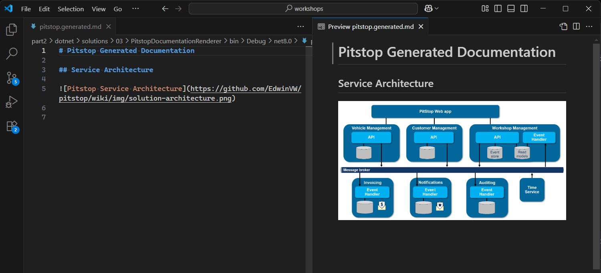

# Generating Markdown Documentation

In this chapter, you’ll extend your previous solution to generate a Markdown documentation file from your analyzed types.

You’ll start with static content, then add dynamic sections based on your code, making the output more useful for both technical and non-technical stakeholders.

## Prerequisites

You’ll need the **.NET SDK** and an editor like **Visual Studio** or **Visual Studio Code**.

> [!TIP]
> You can build on the solution you created in the previous chapter.
> If you prefer, make a copy so you can refer back to your earlier code.

## Step 1: Clean Up the _Project_

Start by commenting out or removing all code after the call to `types.PopulateInheritedMembers()`.

You’ll add new code step by step in this chapter, but having previous examples handy might be useful for reference.

## Step 2: Create a _Markdown Document_

Let’s create your first Markdown file with some static content.
Use the [`StringBuilder` class](https://learn.microsoft.com/dotnet/api/system.text.stringbuilder?wt.mc_id=AZ-MVP-5004268) to assemble the document, and the [`File.WriteAllText` method](https://learn.microsoft.com/dotnet/api/system.io.file.writealltext?wt.mc_id=AZ-MVP-5004268) to write it to disk.

1. Add the `System.Text` namespace on top of your file.

   ```csharp
   using System.Text;
   ```

2. Add the following code to generate a Markdown file with a title, a service architecture chapter containing a diagram.

   ```csharp
   var stringBuilder = new StringBuilder();

   stringBuilder.AppendLine("# Pitstop Generated Documentation");
   stringBuilder.AppendLine();
   stringBuilder.AppendLine("## Service Architecture");
   stringBuilder.AppendLine();
   stringBuilder.AppendLine("");
   stringBuilder.AppendLine();
   ```

3. Add the code to write the content to a file:

   ```csharp
   File.WriteAllText("pitstop.generated.md", stringBuilder.ToString());
   ```

> [!IMPORTANT]
> For the rest of this chapter, add all code before the File.WriteAllText call, otherwise you won’t see the changes in the output file.

Open the `pitstop.generated.md` file in your editor to see the result.
It should be in the output folder of your project, typically `bin\Debug\net8.0`.



## Step 3: Add a Chapter on _Commands_

Next, let’s add some more dynamic content. This dynamic content will change as your application evolves. In this case, you’ll generate a list of all commands found in the source code.

1. First, add a new chapter header for commands:

   ```csharp
   stringBuilder.AppendLine("## Commands");
   stringBuilder.AppendLine();
   ```

2. Now, loop through all commands like you did in the previous chapter,
   but this time, add each command name as a subheading (`###`) of the Commands section to the Markdown document:

   ```csharp
   foreach (var command in types.Where(t => t.ImplementsType("Pitstop.Infrastructure.Messaging.Command")))
   {
     stringBuilder.AppendLine($"### {command}");
   }
   ```
   
This will create a list of commands in the Markdown file, each as a subheading.

```markdown
## Commands

### RegisterCustomer

### RegisterVehicle

### FinishMaintenanceJob

### PlanMaintenanceJob

### RegisterCustomer

### RegisterPlanning

### RegisterVehicle

### FinishMaintenanceJob

### PlanMaintenanceJob

### RegisterPlanning
```

### Step 4: Group and Sort _Commands_ by Service

You might notice that some commands appear multiple times, because both the sender and handler can have separate implementations.
Let’s group commands by name and show which services defined them.

Also, people find it more pleasant to read a list sorted alphabetically, so let’s sort the commands before writing them to the document.

1. Replace your previous loop with this enhanced version:

   ```csharp
   foreach (var group in types.Where(t => t.ImplementsType("Pitstop.Infrastructure.Messaging.Command"))
     .GroupBy(t => t.Name) // Group by command name
     .OrderBy(g => g.Key)) // Order by command name
   {
     stringBuilder.AppendLine($"### {group.Key}"); // Command name as the title
     stringBuilder.AppendLine();

     stringBuilder.AppendLine("#### Namespaces");
     stringBuilder.AppendLine();

     foreach (var command in group.OrderBy(c => c.Namespace))
     {
       stringBuilder.AppendLine($"- {command.Namespace}"); // List namespaces where the command was defined
     }

     stringBuilder.AppendLine();
   }
   ```

   This makes the list of commands more structured and easier to read.
   Each command will have its own section, and the namespaces will be listed under each command.

   For example, the output for the `RegisterCustomer` command will look like this:

   ```markdown
   ### RegisterCustomer

   #### Namespaces

   - Pitstop.CustomerManagementAPI.Commands
   - Pitstop.WebApp.Commands
   ```

2. To make the text less technical:

   - We can utilize our knowledge that the technical names are in [_PascalCase_](https://www.techopedia.com/definition/pascal-case).
     If we insert a space before each uppercase letter, we can create a more readable version of the command names.
     The DendroDocs [`ToSentenceCase` extension method](https://github.com/dendrodocs/dotnet-client-lib/blob/v0.3.0/src/DendroDocs.Client/Extensions/StringExtensions.cs#L131) is very helpful here.
   - The namespaces do not reflect the service names used in the architecture image.
     But we can spot a pattern in the namespace named.

     If you take the second-to-last word in the namespace, it usually reflects the service. Here too, you can insert spaces for readability.
   - Instead of the source-code concept of "Namespaces", use "Services" as the heading to make it more reader-friendly.

    Update the code in the loop to reflect these changes:
  
    ```csharp
    stringBuilder.AppendLine($"### {group.Key.ToSentenceCase()}");

    ...

    stringBuilder.AppendLine("#### Services");

    ...

    stringBuilder.AppendLine($"- {command.Namespace.Split('.')[^2].ToSentenceCase()}");
    ```

    This will produce a more user-friendly output, like this for the `RegisterCustomer` command:

    ```markdown
    ### Register Customer

    #### Services

    - Customer Management API
    - Web App
    ```

Although the documentation is still based on the same technical concepts,
it already is much more readable for a broader set of stakeholders.

### 🧑‍🏫 Assignment

Add a similar chapter for **Events**.

1. Group them by name
2. Show which services define them
3. Use sorting and `ToSentenceCase` for readability.

#### Solution

If you get stuck, you can peek at the solution below.

<details>
<summary>Reveal the solution</summary>

```csharp
stringBuilder.AppendLine("## Events");
stringBuilder.AppendLine();

foreach (var group in types.Where(t => t.ImplementsType("Pitstop.Infrastructure.Messaging.Event"))
  .GroupBy(t => t.Name)
  .OrderBy(t => t.Key))
{
  stringBuilder.AppendLine($"### {group.Key.ToSentenceCase()}");
  stringBuilder.AppendLine();

  stringBuilder.AppendLine("#### Services");
  stringBuilder.AppendLine();

  foreach (var @event in group.OrderBy(e => e.Namespace))
  {
    stringBuilder.AppendLine($"- {@event.Namespace.Split('.')[^2].ToSentenceCase()}");
  }

  stringBuilder.AppendLine();
}
```
</details>

#### Expected Output

The output should read:

```markdown
## Events

### Customer Registered

#### Services

- Customer Management API
- Invoice Service
- Notification Service
- Workshop Management Event Handler

### Day Has Passed

#### Services

- Invoice Service
- Notification Service
- Time Service

### Maintenance Job Finished

#### Services

- Invoice Service
- Notification Service
- Workshop Management API
- Workshop Management Event Handler

### Maintenance Job Planned

#### Services

- Invoice Service
- Notification Service
- Workshop Management API
- Workshop Management Event Handler

### Vehicle Registered

#### Services

- Vehicle Management
- Workshop Management Event Handler

### Workshop Planning Created

#### Services

- Workshop Management API
```

## Step 5: Add _Message Payload Information_

A command or event communicates a set of relevant properties.
As you already have access to the type information, you can add a chapter with these properties in a table.

In Pitstop, the message payload is stored in fields of each command or event class.

> [!NOTE]
> In an event-driven architecture, not every listener is interested in all properties that are sent.
> Therefore, you may see variations in which fields are present for a command or event with the same name. 
> Group the fields to have a single list of event properties.

Since _fields_ is a technical C# term, we will use the term _properties_ in the documentation for broader readability.

1. In the loop for commands, after the list of services, add a heading for the fields:

   ```csharp
   stringBuilder.AppendLine("#### Properties");
   stringBuilder.AppendLine();
   ```

2. Add the code to write the table header:

   ```csharp
   stringBuilder.AppendLine("| Name | Type | Description |");
   stringBuilder.AppendLine("| --- | --- | --- |");
   ```

3. Group the fields by type and name, pick the first one, and sort for readability.

   > [!TIP]
   > Sometimes, valuable information is stored in the XML documentation comments of the field.
   DendroDocs has the capability to read these comments.
   When present, these comments can be added to the documentation as well.

   ```csharp
   foreach (var field in group.SelectMany(t => t.Fields)
     .GroupBy(f => (f.Type, f.Name))
     .Select(g => g.First())
     .OrderBy(f => f.Name))
   {
     stringBuilder.AppendLine($"| {field.Name} | {field.Type} | {field.DocumentationComments?.Summary} |");
   }
   ```

   This will add a properties table to each command subchapter, like this for the `RegisterCustomer` command:

   ```markdown
   ### Register Customer

   #### Services

   - Customer Management API
   - Web App

   #### Properties

   | Property | Type | Description |
   | --- | --- | --- |
   | Address | string |  |
   | City | string |  |
   | CustomerId | string |  |
   | EmailAddress | string |  |
   | MessageId | System.Guid |  |
   | MessageType | string |  |
   | Name | string |  |
   | PostalCode | string |  |
   | TelephoneNumber | string |  |
   ```

   4. Update the type in the table

   While primitive types like `string` and `int` are fine, types like `System.Guid` are quite technical in nature.
   Stripping the namespace will make the documentation more readable.

   For this, you can use the [`ForDiagram` extension method](https://github.com/dendrodocs/dotnet-client-lib/blob/v0.3.0/src/DendroDocs.Client/Extensions/StringExtensions.cs#L100) from DendroDocs, which will convert types to a more readable format.

   ```csharp
   stringBuilder.AppendLine($"| {field.Name} | {field.Type.ForDiagram()} | {field.DocumentationComments?.Summary} |");
   ```

   With this change, the type for `MessageId` will be displayed as `Guid` instead of `System.Guid`.

   ```markdown
   | MessageId | Guid |  |
   ```

> [!NOTE]
> In Pitstop, all commands and events contain one or more fields.
> In other applications, you might encounter commands or events without any fields.
> You could add a check to skip the section if no fields are present.

### 🧑‍🏫 Assignment

Add the properties table for events as well, using the same pattern as for the commands.

1. Add a chapter heading
2. Add a table header
3. Group and sort the fields by type and name, then add them to the table.
4. Make types more readable by using `ForDiagram `.

#### Solution

If you get stuck, you can peek at the solution below.

<details>
<summary>Reveal the solution</summary>

```csharp
stringBuilder.AppendLine("#### Properties");
stringBuilder.AppendLine();

stringBuilder.AppendLine("| Property | Type | Description |");
stringBuilder.AppendLine("| --- | --- | --- |");

foreach (var field in group.SelectMany(t => t.Fields)
    .GroupBy(f => (f.Type, f.Name))
    .Select(g => g.First())
    .OrderBy(f => f.Name))
{
    stringBuilder.AppendLine($"| {field.Name} | {field.Type.ForDiagram()} | {field.DocumentationComments?.Summary} |");
}

stringBuilder.AppendLine();
```
</details>

#### Expected Output

The output should read:

<details>
<summary>Reveal the output</summary>

```markdown
## Events

### Customer Registered

#### Services

- Customer Management API
- Invoice Service
- Notification Service
- Workshop Management Event Handler

#### Properties

| Property | Type | Description |
| --- | --- | --- |
| Address | string |  |
| City | string |  |
| CustomerId | string |  |
| EmailAddress | string |  |
| MessageId | Guid |  |
| MessageType | string |  |
| Name | string |  |
| PostalCode | string |  |
| TelephoneNumber | string |  |

### Day Has Passed

#### Services

- Invoice Service
- Notification Service
- Time Service

#### Properties

| Property | Type | Description |
| --- | --- | --- |
| MessageId | Guid |  |
| MessageType | string |  |

### Maintenance Job Finished

#### Services

- Invoice Service
- Notification Service
- Workshop Management API
- Workshop Management Event Handler

#### Properties

| Property | Type | Description |
| --- | --- | --- |
| EndTime | DateTime |  |
| JobId | string |  |
| JobId | Guid |  |
| MessageId | Guid |  |
| MessageType | string |  |
| Notes | string |  |
| StartTime | DateTime |  |

### Maintenance Job Planned

#### Services

- Invoice Service
- Notification Service
- Workshop Management API
- Workshop Management Event Handler

#### Properties

| Property | Type | Description |
| --- | --- | --- |
| CustomerInfo | (string Id, string Name, string TelephoneNumber) |  |
| Description | string |  |
| EndTime | DateTime |  |
| JobId | string |  |
| JobId | Guid |  |
| MessageId | Guid |  |
| MessageType | string |  |
| StartTime | DateTime |  |
| VehicleInfo | (string LicenseNumber, string Brand, string Type) |  |

### Vehicle Registered

#### Services

- Vehicle Management
- Workshop Management Event Handler

#### Properties

| Property | Type | Description |
| --- | --- | --- |
| Brand | string |  |
| LicenseNumber | string |  |
| MessageId | Guid |  |
| MessageType | string |  |
| OwnerId | string |  |
| Type | string |  |

### Workshop Planning Created

#### Services

- Workshop Management API

#### Properties

| Property | Type | Description |
| --- | --- | --- |
| Date | DateTime |  |
| MessageId | Guid |  |
| MessageType | string |  |
```
</details>

## Conclusion

You have successfully created a Markdown documentation file that includes static content, dynamic sections for commands and events, and detailed property information.

## Solution

If you want to see the complete solution, you can find it in the [Pitstop Documentation Renderer repository](../solutions/03/PitstopDocumentationRenderer).
The solution includes all the steps covered in this chapter.

<details>
<summary>Reveal the total output</summary>

```markdown
# Pitstop Generated Documentation

## Service Architecture


## Commands

### Finish Maintenance Job

#### Services

- Web App
- Workshop Management API

#### Properties

| Property | Type | Description |
| --- | --- | --- |
| EndTime | DateTime |  |
| JobId | Guid |  |
| MessageId | Guid |  |
| MessageType | string |  |
| Notes | string |  |
| StartTime | DateTime |  |

### Plan Maintenance Job

#### Services

- Web App
- Workshop Management API

#### Properties

| Property | Type | Description |
| --- | --- | --- |
| CustomerInfo | (string Id, string Name, string TelephoneNumber) |  |
| Description | string |  |
| EndTime | DateTime |  |
| JobId | Guid |  |
| MessageId | Guid |  |
| MessageType | string |  |
| StartTime | DateTime |  |
| VehicleInfo | (string LicenseNumber, string Brand, string Type) |  |

### Register Customer

#### Services

- Customer Management API
- Web App

#### Properties

| Property | Type | Description |
| --- | --- | --- |
| Address | string |  |
| City | string |  |
| CustomerId | string |  |
| EmailAddress | string |  |
| MessageId | Guid |  |
| MessageType | string |  |
| Name | string |  |
| PostalCode | string |  |
| TelephoneNumber | string |  |

### Register Planning

#### Services

- Web App
- Workshop Management API

#### Properties

| Property | Type | Description |
| --- | --- | --- |
| MessageId | Guid |  |
| MessageType | string |  |
| PlanningDate | DateTime |  |

### Register Vehicle

#### Services

- Vehicle Management
- Web App

#### Properties

| Property | Type | Description |
| --- | --- | --- |
| Brand | string |  |
| LicenseNumber | string |  |
| MessageId | Guid |  |
| MessageType | string |  |
| OwnerId | string |  |
| Type | string |  |

## Events

### Customer Registered

#### Services

- Customer Management API
- Invoice Service
- Notification Service
- Workshop Management Event Handler

#### Properties

| Property | Type | Description |
| --- | --- | --- |
| Address | string |  |
| City | string |  |
| CustomerId | string |  |
| EmailAddress | string |  |
| MessageId | Guid |  |
| MessageType | string |  |
| Name | string |  |
| PostalCode | string |  |
| TelephoneNumber | string |  |

### Day Has Passed

#### Services

- Invoice Service
- Notification Service
- Time Service

#### Properties

| Property | Type | Description |
| --- | --- | --- |
| MessageId | Guid |  |
| MessageType | string |  |

### Maintenance Job Finished

#### Services

- Invoice Service
- Notification Service
- Workshop Management API
- Workshop Management Event Handler

#### Properties

| Property | Type | Description |
| --- | --- | --- |
| EndTime | DateTime |  |
| JobId | string |  |
| JobId | Guid |  |
| MessageId | Guid |  |
| MessageType | string |  |
| Notes | string |  |
| StartTime | DateTime |  |

### Maintenance Job Planned

#### Services

- Invoice Service
- Notification Service
- Workshop Management API
- Workshop Management Event Handler

#### Properties

| Property | Type | Description |
| --- | --- | --- |
| CustomerInfo | (string Id, string Name, string TelephoneNumber) |  |
| Description | string |  |
| EndTime | DateTime |  |
| JobId | string |  |
| JobId | Guid |  |
| MessageId | Guid |  |
| MessageType | string |  |
| StartTime | DateTime |  |
| VehicleInfo | (string LicenseNumber, string Brand, string Type) |  |

### Vehicle Registered

#### Services

- Vehicle Management
- Workshop Management Event Handler

#### Properties

| Property | Type | Description |
| --- | --- | --- |
| Brand | string |  |
| LicenseNumber | string |  |
| MessageId | Guid |  |
| MessageType | string |  |
| OwnerId | string |  |
| Type | string |  |

### Workshop Planning Created

#### Services

- Workshop Management API

#### Properties

| Property | Type | Description |
| --- | --- | --- |
| Date | DateTime |  |
| MessageId | Guid |  |
| MessageType | string |  |
```
</details>

