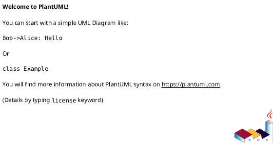
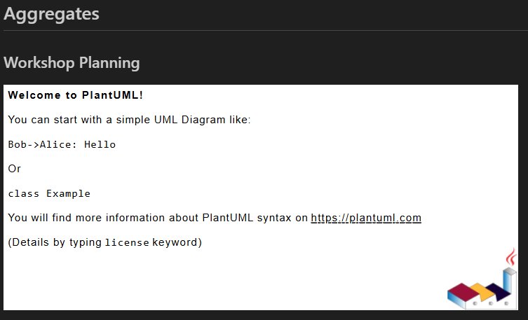
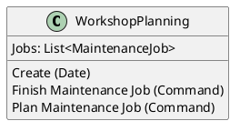
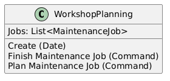
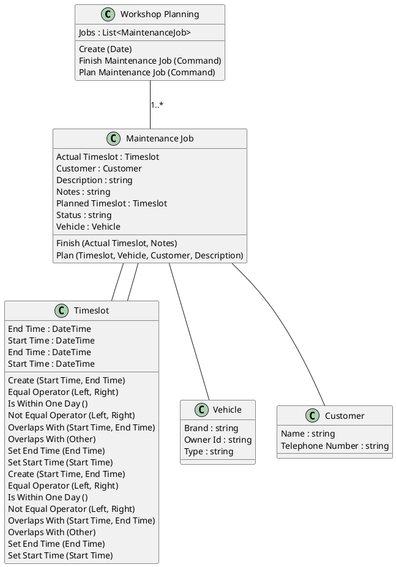
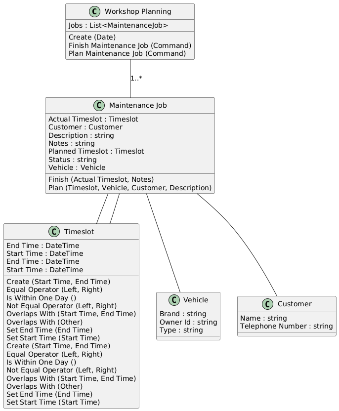

# Generating Class Diagrams

In this chapter, you’ll extend your documentation generator to create class diagrams using PlantUML.
These diagrams help you visualize your codebase, making it easier to understand relationships between your domain objects.

You’ll build on the solution from the previous chapter.
If you prefer, make a copy so you can refer back to your earlier code as you try things out.

## Prerequisites

You’ll need the **.NET SDK** and an editor like **Visual Studio** or **Visual Studio Code**.

> [!TIP]
> When working with Visual Studio Code, if you haven’t already, 
> install the [PlantUML extension](https://marketplace.visualstudio.com/items?itemName=jebbs.plantuml) so you can preview your diagrams directly in your editor.

> [!TIP]
> You can build on the solution you created in the previous chapter.
> If you prefer, make a copy so you can refer back to your earlier code.

## Step 1: Add a _Diagram_ Section

In Pitstop, aggregate roots implement the generic base class `Pitstop.WorkshopManagementAPI.Domain.Core.AggregateRoot<T>`.

Let’s add a section to your Markdown documentation for aggregates, and create a section for each aggregate root.

Add this after your previous documentation code, but before the `File.WriteAllText` line:

```csharp
stringBuilder.AppendLine("## Aggregates");
stringBuilder.AppendLine();

foreach (var aggregateRoot in types.Where(t => t.ImplementsTypeStartsWith("Pitstop.WorkshopManagementAPI.Domain.Core.AggregateRoot<"))
  .OrderBy(a => a.Name))
{
  stringBuilder.AppendLine($"### {aggregateRoot.Name.ToSentenceCase()}");
  stringBuilder.AppendLine();
}
```

A single aggregate is shown in the output, but it isn’t very useful yet.

```markdown
## Aggregates

### Workshop Planning

```

## Interlude: _Aggregates, Entities, and Value Objects (DDD Basics)_

> [!IMPORTANT]
> **Aggregates, Roots, Entities, Value Objects: The Basics**
>
> If you’re not familiar with Domain-Driven Design (DDD), here’s what these terms mean:
>
> **Aggregate**  
> A group of related objects (entities and value objects) that belong together as one unit for data changes. Aggregates help keep your domain model consistent.
>
> **Aggregate Root**  
> The main entity inside an aggregate. Other code should only interact with the root, not with its child objects directly.
>
> **Entity**  
> An object with an identity and its own lifecycle, for example a “Customer” or “Order.”
>
> **Value Object**  
> An object described only by its properties (not an ID). Examples: “Address” or “Money.” Value objects are immutable and can be replaced if their values are the same.
>
> In this workshop, you’ll see these patterns reflected in the code and diagrams. Want to know more? See the [Domain-Driven Design Reference](https://www.domainlanguage.com/ddd/reference/) by Eric Evans.

## Step 2: Add a _Diagram_

Next, let’s add a code block for the contents of the diagram.

> [!NOTE]
> Although this chapter uses [PlantUML](https://plantuml.com/), an alternative is to use [Mermaid](https://mermaid.js.org/), which is almost identical in syntax.

To include a PlantUML diagram in your Markdown file, add a fenced code block with the plantuml language tag.
The diagram definition goes between @startuml and @enduml.

```csharp
stringBuilder.AppendLine("```plantuml");
stringBuilder.AppendLine("@startuml");

// Add diagram content here

stringBuilder.AppendLine("@enduml");
stringBuilder.AppendLine("```");
stringBuilder.AppendLine();
```

This will create a section in your Markdown file that looks like this:

````markdown
### Workshop Planning


````

When you view the file, it will show a placeholder for the diagram:



## Step 3: Generate the Diagram

PlantUML lets you create a **class** diagram by using the `class` keyword.
Let’s add the aggregate root class definition to the diagram.

Inside the diagram block, add the class using:

```csharp
stringBuilder.AppendLine($"class {aggregateRoot.Name} {{");

stringBuilder.AppendLine("}");
```

Now an empty class box is rendered in the diagram.

## Step 4: Adding _Members_ to the Class

1. Loop through the properties of the aggregate root, and add each one to the class.
   - Only show the property's name and type.
   - Filter out private properties using the `IsPrivate()` extension method.
   - Order the properties by name, and add spaces using `ToSentenceCase()`.
   - Hide namespaces in the type names using the `ForDiagram()` extension method.

   ```csharp
   foreach (var property in aggregateRoot.Properties.Where(p => !p.IsPrivate())
     .OrderBy(p => p.Name))
   {
     stringBuilder.AppendLine($"  {property.Name.ToSentenceCase()}: {property.Type.ForDiagram()}");
   }
   ```

2. Do the same for public methods that do not override base methods:
   - Only show the method's name and type.
   - Filter out private and overridden methods using the `IsPrivate()` and `IsOverride()` extension methods.
   - Order the methods by name, and add spaces using `ToSentenceCase()`.
   - Hide namespaces in the parameter type names using the `ForDiagram()` extension method.

   ```csharp
   foreach (var method in aggregateRoot.Methods.Where(m => !m.IsPrivate() && !m.IsOverride())
     .OrderBy(m => m.Name))
   {
     var parameters = string.Join(", ", method.Parameters.Select(p => $"{p.Name.ToSentenceCase()}: {p.Type.ForDiagram()}"));
     stringBuilder.AppendLine($"  {method.Name.ToSentenceCase()} ({parameters})");
   }
   ```

This results in a class diagram that looks like this:

````markdown

````

And renders like this:



## Step 5: Refactor with a _Helper Method_

To keep your code clean, move the logic for rendering a class into a separate method, so you can use it multiple times.

Put it at the bottom of your file.

```csharp
void RenderClass(StringBuilder stringBuilder, TypeDescription type)
{
    stringBuilder.AppendLine($@"class {type.Name} as "{type.Name.ToSentenceCase()}" {{");

    foreach (var property in type.Properties.Where(p => !p.IsPrivate())
        .OrderBy(p => p.Name))
    {
        stringBuilder.AppendLine($"  {property.Name.ToSentenceCase()}: {property.Type.ForDiagram()}");
    }

    foreach (var method in type.Methods.Where(m => !m.IsPrivate() && !m.IsOverride())
        .OrderBy(m => m.Name))
    {
        var parameterList = string.Join(", ", method.Parameters.Select(p => p.Name.ToSentenceCase()));
        stringBuilder.AppendLine($"  {method.Name.ToSentenceCase()} ({parameterList})");
    }

    stringBuilder.AppendLine("}");
    stringBuilder.AppendLine();
}
```

Change the code that generated the class diagram to call the new method:

```csharp
RenderClass(stringBuilder, aggregateRoot);
```

## Step 6: Add _Relationships_ between Classes

Aggregate roots typically have properties that reference other types in your domain model.
For example, the aggregate root might have a property of a value object type, which you’ll want to show in your diagram.

You can detect these relationships and render the related classes as well:

When looping through the properties of the aggregate root, check if the property type is a class we know about. Default system classes like `string` and `DateTime` are not part of the analysis, so they are not included in the diagram.

So, after the properties are added to the class, you can loop through them again to find related types. You can also check if the type is enumerable, which indicates a collection of items.

```csharp
foreach (var property in type.Properties)
{
  var relatedType = types.FirstOrDefault(
    t => t.FullName == property.Type || 
    (property.Type.IsEnumerable() && t.FullName == property.Type.GenericTypes()[0]));
  if (relatedType is not null)
  {
    RenderClass(stringBuilder, relatedType);

    // Add a relationship line
    stringBuilder.Append($"{type.Name} -- {relatedType.Name}");
    if (property.Type.IsEnumerable())
    {
      stringBuilder.Append(" : 1..*");
    }
    stringBuilder.AppendLine();
    stringBuilder.AppendLine();
  }
}
```

> [!NOTE]
> This pattern is recursive! 
> When you render the class for a related type, it can repeat the process to bring in further relationships.

By the power of recursion, the simple class has grown quite a bit:

````markdown

````

And rendered like this:



## Step 7: Use _PlantUML.Builder_ for Cleaner Code _(Optional)_

Currently, you’re building the PlantUML diagram as a string in your code.
This works, but it can get messy, especially as your diagrams grow in complexity.

Instead, you can use the PlantUML.Builder NuGet package to create diagrams in a more structured way. This package provides a set of extension methods that make it easier to build PlantUML diagrams without dealing with raw strings.

1. Install the PlantUML.Builder NuGet package in your project.
2. Add the following using statement at the top of your file:

   ```csharp
   using PlantUml.Builder;
   using PlantUml.Builder.ClassDiagrams;
   ```
3. Replace your diagram generation code with the following:

   ```csharp
   void RenderClassPlantUmlBuilder(StringBuilder stringBuilder, TypeDescription type)
   {
     stringBuilder.ClassStart(type.Name, displayName: type.Name.ToSentenceCase());

     foreach (var property in type.Properties.Where(p => !p.IsPrivate())
       .OrderBy(p => p.Name))
     {
       stringBuilder.InlineClassMember($"{property.Name.ToSentenceCase()} : {property.Type.ForDiagram()}");
     }

      foreach (var method in type.Methods.Where(m => !m.IsPrivate() && !m.IsOverride())
        .OrderBy(m => m.Name))
      {
        var parameterList = string.Join(", ", method.Parameters.Select(p => p.Name.ToSentenceCase()));
        stringBuilder.InlineClassMember($"  {method.Name.ToSentenceCase()} ({parameterList})");
      }

      stringBuilder.ClassEnd();
      stringBuilder.AppendNewLine();

      foreach (var property in type.Properties)
      {
        var relatedType = types.FirstOrDefault(
          t => t.FullName == property.Type || // Type has been detected, it's part of the project
          (property.Type.IsEnumerable() && t.FullName == property.Type.GenericTypes()[0])); // Type is enumerable, and the generic type is part of the project
        if (relatedType is not null)
        {
          RenderClass(stringBuilder, relatedType); // Recursively render the related type

          if (!property.Type.IsEnumerable())
          {
            stringBuilder.Relationship(type.Name, "--", relatedType.Name); // Add a relationship line
          }
          else
          {
            stringBuilder.Relationship(type.Name, "--", relatedType.Name, label: "1..*"); // Add a relationship line and indicate a one-to-many relationship
            }
          stringBuilder.AppendNewLine();
          stringBuilder.AppendNewLine();
        }
     }
   }
   ```

## Step 8: Add _Stereotypes_ _(Awesomesauce)_

Implement stereotypes and custom spots on the classes to distinguish between value objects, entities, and the root.

## Conclusion

You’ve now extended your documentation generator to create class diagrams using PlantUML.
These diagrams help you visualize your codebase, making it easier to understand relationships between your domain objects and their properties and methods.

## Solution

You can find the complete solution for this chapter in the [PitstopDocumentationRenderer](solutions/04/PitstopDocumentationRenderer/).
The solution includes all the steps covered in this chapter.


<details>
<summary>Reveal the total output</summary>

```markdown
# Pitstop Generated Documentation

## Service Architecture


## Commands

### Finish Maintenance Job

#### Services

- Web App
- Workshop Management API

#### Properties

| Property | Type | Description |
| --- | --- | --- |
| EndTime | DateTime |  |
| JobId | Guid |  |
| MessageId | Guid |  |
| MessageType | string |  |
| Notes | string |  |
| StartTime | DateTime |  |

### Plan Maintenance Job

#### Services

- Web App
- Workshop Management API

#### Properties

| Property | Type | Description |
| --- | --- | --- |
| CustomerInfo | (string Id, string Name, string TelephoneNumber) |  |
| Description | string |  |
| EndTime | DateTime |  |
| JobId | Guid |  |
| MessageId | Guid |  |
| MessageType | string |  |
| StartTime | DateTime |  |
| VehicleInfo | (string LicenseNumber, string Brand, string Type) |  |

### Register Customer

#### Services

- Customer Management API
- Web App

#### Properties

| Property | Type | Description |
| --- | --- | --- |
| Address | string |  |
| City | string |  |
| CustomerId | string |  |
| EmailAddress | string |  |
| MessageId | Guid |  |
| MessageType | string |  |
| Name | string |  |
| PostalCode | string |  |
| TelephoneNumber | string |  |

### Register Planning

#### Services

- Web App
- Workshop Management API

#### Properties

| Property | Type | Description |
| --- | --- | --- |
| MessageId | Guid |  |
| MessageType | string |  |
| PlanningDate | DateTime |  |

### Register Vehicle

#### Services

- Vehicle Management
- Web App

#### Properties

| Property | Type | Description |
| --- | --- | --- |
| Brand | string |  |
| LicenseNumber | string |  |
| MessageId | Guid |  |
| MessageType | string |  |
| OwnerId | string |  |
| Type | string |  |

## Events

### Customer Registered

#### Services

- Customer Management API
- Invoice Service
- Notification Service
- Workshop Management Event Handler

#### Properties

| Property | Type | Description |
| --- | --- | --- |
| Address | string |  |
| City | string |  |
| CustomerId | string |  |
| EmailAddress | string |  |
| MessageId | Guid |  |
| MessageType | string |  |
| Name | string |  |
| PostalCode | string |  |
| TelephoneNumber | string |  |

### Day Has Passed

#### Services

- Invoice Service
- Notification Service
- Time Service

#### Properties

| Property | Type | Description |
| --- | --- | --- |
| MessageId | Guid |  |
| MessageType | string |  |

### Maintenance Job Finished

#### Services

- Invoice Service
- Notification Service
- Workshop Management API
- Workshop Management Event Handler

#### Properties

| Property | Type | Description |
| --- | --- | --- |
| EndTime | DateTime |  |
| JobId | string |  |
| JobId | Guid |  |
| MessageId | Guid |  |
| MessageType | string |  |
| Notes | string |  |
| StartTime | DateTime |  |

### Maintenance Job Planned

#### Services

- Invoice Service
- Notification Service
- Workshop Management API
- Workshop Management Event Handler

#### Properties

| Property | Type | Description |
| --- | --- | --- |
| CustomerInfo | (string Id, string Name, string TelephoneNumber) |  |
| Description | string |  |
| EndTime | DateTime |  |
| JobId | string |  |
| JobId | Guid |  |
| MessageId | Guid |  |
| MessageType | string |  |
| StartTime | DateTime |  |
| VehicleInfo | (string LicenseNumber, string Brand, string Type) |  |

### Vehicle Registered

#### Services

- Vehicle Management
- Workshop Management Event Handler

#### Properties

| Property | Type | Description |
| --- | --- | --- |
| Brand | string |  |
| LicenseNumber | string |  |
| MessageId | Guid |  |
| MessageType | string |  |
| OwnerId | string |  |
| Type | string |  |

### Workshop Planning Created

#### Services

- Workshop Management API

#### Properties

| Property | Type | Description |
| --- | --- | --- |
| Date | DateTime |  |
| MessageId | Guid |  |
| MessageType | string |  |

## Aggregates

### Workshop Planning


</details>
