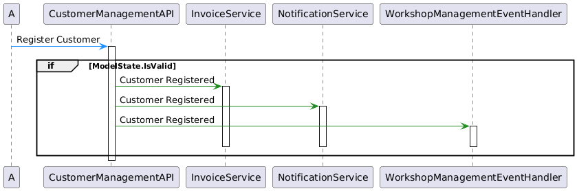
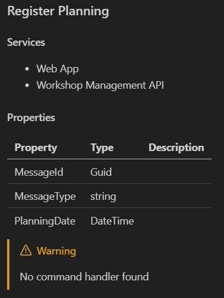
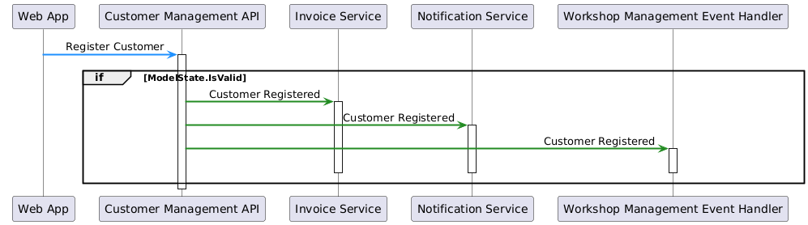
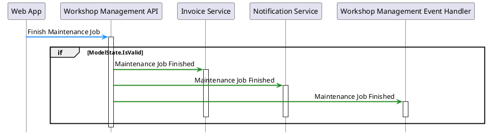
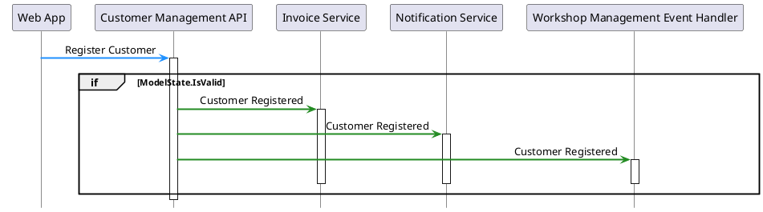
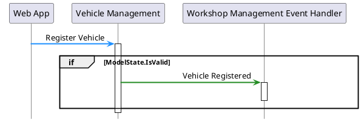
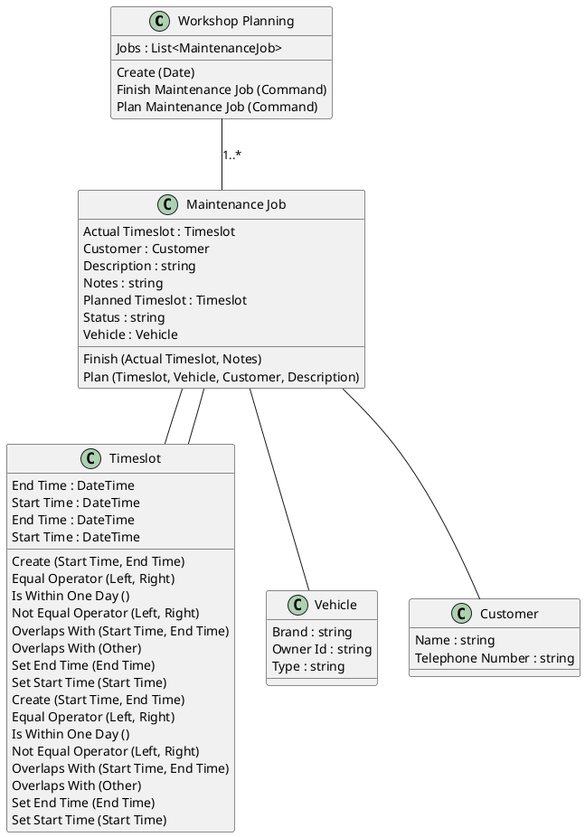

# Generating a Sequence Diagram

In this chapter, you’ll extend your documentation generator to create sequence diagrams that visualize message flow between services.

The code required to traverse call trees, trace invocations, and generate the necessary UML is too large and complex to walk through in detail as we did in previous chapters.
Instead, you’ll reuse key building blocks and copy in the provided utilities.

## Prerequisites

For this chapter, you’ll need the **.NET SDK** and **Visual Studio** or **Visual Studio Code**.

> [!TIP]
> You can build on the solution you created in the previous chapter,
> or if you prefer, make a copy so you can refer back to your earlier code.

## Step 1: Add _Supporting Code_

Download the following files from the [workshop GitHub repository](https://github.com/dendrodocs/workshops) and add them to your project:

- [TypeDescriptionListExtensions.cs](https://github.com/dendrodocs/workshops/blob/main/part2/dotnet/solutions/05/PitstopDocumentationRenderer/TypeDescriptionListExtensions.cs)

  _Extension methods for traversing and querying type and invocation trees._

- [InteractionTraverser.cs](https://github.com/dendrodocs/workshops/blob/main/part2/dotnet/solutions/05/PitstopDocumentationRenderer/InteractionTraverser.cs)
  
  _Traces the consequences of receiving a message, following invocations through the code, and tracking the path through services, loops, and conditionals._

- [UmlFragmentRenderer.cs](https://github.com/dendrodocs/workshops/blob/main/part2/dotnet/solutions/05/PitstopDocumentationRenderer/UmlFragmentRenderer.cs)

  _Converts the traced interactions into PlantUML sequence diagrams, in a separate pass for better rendering._

If you haven't already, add the PlantUML.Builder namespaces to your project:

   ```csharp
   using PlantUml.Builder;
   using PlantUml.Builder.ClassDiagrams;
   using PlantUml.Builder.SequenceDiagrams;
   ```

## Step 2: Add a _Command Diagram Renderer_

Add a new method called `RenderCommandDiagram`. It should take a `StringBuilder` and a `TypeDescription` as parameters.

- Create a list to store the names of the services involved, so you can add all participants to the diagram.
- Use the `InteractionTraverser` to extract the consequences (the full interaction tree) of a given command type.
- Use the `UmlFragmentRenderer.RenderTree` method to convert the traced interaction fragments into PlantUML content.

The method should look like this:

```csharp
void RenderCommandDiagram(StringBuilder stringBuilder, TypeDescription type)
{
  var services = new List<string>();
  var interactions = new InteractionTraverser(types).ExtractConsequences(type, services);

  var innerBuilder = new StringBuilder();
  UmlFragmentRenderer.RenderTree(innerBuilder, interactions.Fragments, interactions);

  stringBuilder.AppendLine("```plantuml");
  stringBuilder.UmlDiagramStart();

  // Add participant declarations here (see next step)

  stringBuilder.Append(innerBuilder);

  stringBuilder.UmlDiagramEnd();
  stringBuilder.AppendLine("```");
  stringBuilder.AppendLine();
}
```

## Step 3: Add the _Renderer_ to Your Documentation

Find the section where you are writing the commands to your documentation file (after the properties table).
Use the `Types.CommandHandlerFor` method to check if a handler exists for the command.

- If a handler is found, call your new `RenderCommandDiagram` method.
- If not, add a note to the documentation; this might spark useful discussions with stakeholders.

```csharp
var noHandler = true;
foreach (var type in group)
{
  if (types.CommandHandlerFor(type) is not null)
  {
    RenderCommandDiagram(stringBuilder, type);
    noHandler = false;
    break;
  }
}

if (noHandler)
{
  stringBuilder.AppendLine("> [!WARNING]");
  stringBuilder.AppendLine("> No command handler found");
  stringBuilder.AppendLine();
}
```

A sequence diagram for the `RegisterCustomer` command might look like this:



And when a command handler is not found, it will show a warning, in this case with `RegisterPlanning`.



## Step 4: _Improving_ the Diagram Readability

You can make your sequence diagrams easier to follow by improving how participants are labeled and styled.

### Fixing the "A" Participant

Sometimes, the traverser can’t find the service that produces the command, resulting in an unclear participant like "A".

You can fix this by explicitly looking up the source of the command and inserting it at the beginning of your `services` list.

Place the code right after the `ExtractConsequences` call in your `RenderCommandDiagram` method:

```csharp
// Fix missing caller
var callingServices = types.GetSourceCommands(type);
if (callingServices.Count == 1)
{
  var service = InteractionTraverser.Service(callingServices[0]);

  services.Insert(0, service);
  interactions.Fragments.OfType<DendroDocs.Uml.Fragments.Arrow>().First().Source = service;
}
```

### Declaring Participants

PlantUML adds participants in the order they first appear.

The `services` collection reflects the actual call order.
To control the display names and the order in the diagram, declare all participants at the start of the diagram:

```csharp
foreach (var service in services)
{
  stringBuilder.Participant(service, displayName: service.ToSentenceCase());
}
```

### Adding Style

For a more pleasant diagram, set PlantUML skin parameters right after the `UmlDiagramStart` call in your `RenderCommandDiagram` method:

```csharp
stringBuilder.SkinParameter(SkinParameter.SequenceMessageAlignment, "reverseDirection");
stringBuilder.SkinParameter(SkinParameter.SequenceGroupBodyBackgroundColor, "Transparent");
stringBuilder.SkinParameter(SkinParameter.SequenceBoxBackgroundColor, "#Gainsboro");
stringBuilder.SkinParameter(SkinParameter.SequenceArrowThickness, 2);
stringBuilder.SkinParameter(SkinParameter.BoxPadding, 10);
stringBuilder.SkinParameter(SkinParameter.ParticipantPadding, 10);
stringBuilder.SkinParameter(SkinParameter.LifelineStrategy, "solid");
```

This produces a more professional and readable result:



## Conclusion

In this chapter, you learned how to generate sequence diagrams that visualize the flow of messages between services in your application.
You reused existing utilities to trace interactions and render them as PlantUML diagrams.

However, the code can become quite complicated, especially when dealing with complex interactions, multiple services, and attempts to show activity lines, alternatives, and loops.

## Solution

You can find the complete solution for this chapter in the [PitstopDocumentationRenderer](solutions/05/PitstopDocumentationRenderer/).
The solution includes all the steps covered in this chapter.


<details>
<summary>Reveal the total output</summary>

```markdown
# Pitstop Generated Documentation

## Service Architecture


## Commands

### Finish Maintenance Job

#### Services

- Web App
- Workshop Management API

#### Properties

| Property | Type | Description |
| --- | --- | --- |
| EndTime | DateTime |  |
| JobId | Guid |  |
| MessageId | Guid |  |
| MessageType | string |  |
| Notes | string |  |
| StartTime | DateTime |  |



### Plan Maintenance Job

#### Services

- Web App
- Workshop Management API

#### Properties

| Property | Type | Description |
| --- | --- | --- |
| CustomerInfo | (string Id, string Name, string TelephoneNumber) |  |
| Description | string |  |
| EndTime | DateTime |  |
| JobId | Guid |  |
| MessageId | Guid |  |
| MessageType | string |  |
| StartTime | DateTime |  |
| VehicleInfo | (string LicenseNumber, string Brand, string Type) |  |


### Register Customer

#### Services

- Customer Management API
- Web App

#### Properties

| Property | Type | Description |
| --- | --- | --- |
| Address | string |  |
| City | string |  |
| CustomerId | string |  |
| EmailAddress | string |  |
| MessageId | Guid |  |
| MessageType | string |  |
| Name | string |  |
| PostalCode | string |  |
| TelephoneNumber | string |  |



### Register Planning

#### Services

- Web App
- Workshop Management API

#### Properties

| Property | Type | Description |
| --- | --- | --- |
| MessageId | Guid |  |
| MessageType | string |  |
| PlanningDate | DateTime |  |

> [!WARNING]
> No command handler found

### Register Vehicle

#### Services

- Vehicle Management
- Web App

#### Properties

| Property | Type | Description |
| --- | --- | --- |
| Brand | string |  |
| LicenseNumber | string |  |
| MessageId | Guid |  |
| MessageType | string |  |
| OwnerId | string |  |
| Type | string |  |



## Events

### Customer Registered

#### Services

- Customer Management API
- Invoice Service
- Notification Service
- Workshop Management Event Handler

#### Properties

| Property | Type | Description |
| --- | --- | --- |
| Address | string |  |
| City | string |  |
| CustomerId | string |  |
| EmailAddress | string |  |
| MessageId | Guid |  |
| MessageType | string |  |
| Name | string |  |
| PostalCode | string |  |
| TelephoneNumber | string |  |

### Day Has Passed

#### Services

- Invoice Service
- Notification Service
- Time Service

#### Properties

| Property | Type | Description |
| --- | --- | --- |
| MessageId | Guid |  |
| MessageType | string |  |

### Maintenance Job Finished

#### Services

- Invoice Service
- Notification Service
- Workshop Management API
- Workshop Management Event Handler

#### Properties

| Property | Type | Description |
| --- | --- | --- |
| EndTime | DateTime |  |
| JobId | string |  |
| JobId | Guid |  |
| MessageId | Guid |  |
| MessageType | string |  |
| Notes | string |  |
| StartTime | DateTime |  |

### Maintenance Job Planned

#### Services

- Invoice Service
- Notification Service
- Workshop Management API
- Workshop Management Event Handler

#### Properties

| Property | Type | Description |
| --- | --- | --- |
| CustomerInfo | (string Id, string Name, string TelephoneNumber) |  |
| Description | string |  |
| EndTime | DateTime |  |
| JobId | string |  |
| JobId | Guid |  |
| MessageId | Guid |  |
| MessageType | string |  |
| StartTime | DateTime |  |
| VehicleInfo | (string LicenseNumber, string Brand, string Type) |  |

### Vehicle Registered

#### Services

- Vehicle Management
- Workshop Management Event Handler

#### Properties

| Property | Type | Description |
| --- | --- | --- |
| Brand | string |  |
| LicenseNumber | string |  |
| MessageId | Guid |  |
| MessageType | string |  |
| OwnerId | string |  |
| Type | string |  |

### Workshop Planning Created

#### Services

- Workshop Management API

#### Properties

| Property | Type | Description |
| --- | --- | --- |
| Date | DateTime |  |
| MessageId | Guid |  |
| MessageType | string |  |

## Aggregates

### Workshop Planning


</details>
